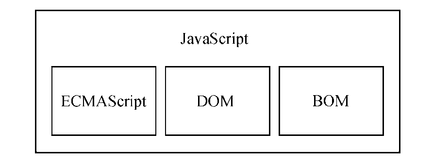
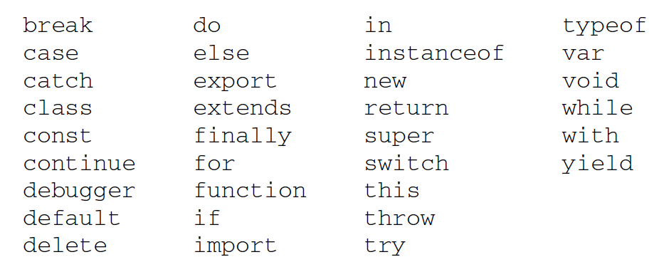

## 1. JavaScript 简介

**JavaScript** 是一门用来与网页交互的，多范式动态的脚本语言，包含类型、运算符、标准内置（ built-in）对象和方法。JavaScript 通过**原型链**来支持 OOP，也支持函数式编程。函数也是对象，可以被保存在变量中，并且像其他对象一样被传递。

JavaScript 没有输入或输出的概念，它在**宿主环境（host environment）**运行，任何与外界沟通的机制都是由宿主环境提供的。浏览器、服务器端环境（[Node.js](http://nodejs.org) ）、NoSQL 数据库（ [Apache CouchDB](http://couchdb.apache.org)）、嵌入式计算机、GNOME都是比较常见的宿主环境。宿主为 JavaScript 定义了与外界交互所需的全部API（DOM、网络请求、系统硬件、存储、事件、文件和加密等）。各种浏览器及其JavaScript 引擎都按照自己的理解实现了这些规范。Chrome 有Blink/V8，Firefox有Gecko/SpiderMonkey，Safari WebKit/JavaScriptCore。

完整的 JavaScript 包含 ECMAScript、DOM 和 BOM。



- **ECMAScript（核心）- 定义并提供核心功能**

  ECMA-262 定义了JavaScript，描述了语法、类型、语句、关键字、保留字、操作符、全局对象等内容。

  

- **文档对象模型（DOM）- 提供与网页内容交互的方法和接口**

  - 用于在HTML 中使用扩展的XML的**API**，DOM 能够保持Web 跨平台的本性。

  - DOM 将整个页面抽象为一组**分层节点**。

  - DOM 通过**创建表示文档的树**以便删除、添加、替换、修改节点。

  

- **浏览器对象模型（BOM）- 提供与浏览器交互的方法和接口**

  浏览器对象模型（BOM，Browser Object Model）是用于支持访问和操作浏览器的窗口的 API。使用BOM，开发者可以操控浏览器显示页面之外的部分。BOM 主要针对浏览器窗口和子窗口（frame）。


## 2. 在 HTML 中使用 JavaScript

### 要点

- 要包含外部 JavaScript 文件，必须将src 属性设置为要包含文件的URL。文件可以跟网页在同一台服务器上，也可以位于完全不同的域。
- 所有`<script>`元素会依照它们在网页中出现的次序被解释。在不使用`defer` 和`async` 属性的情况下，包含在`<script>`元素中的代码必须严格按次序解释。
- 不推迟执行的脚本，浏览器必须解释完位于`<script>`元素中的代码，然后才能继续渲染页面的剩余部分。
- 现代 Web 应用程序通常应该把`<script>`元素放到页面末尾，介于主内容之后及`</body>`标签之前。页面会在处理 JavaScript 代码之前完全渲染页面。
- 使用 `defer` 属性把脚本推迟到文档渲染完毕后再执行。
- 使用`async` 属性表示异步加载（脚本不需要等待其他脚本，也不阻塞文档渲染）。异步脚本不能保证按照它们在页面中出现的次序执行。
- 使用`<noscript>`优雅降级，指定在浏览器不支持脚本时显示的内容。

### 使用`<script>`元素将 JavaScript 插入HTML

| 主要属性      | 作用（均可选）                                               | 说明                                    |
| ------------- | ------------------------------------------------------------ | --------------------------------------- |
| `async`       | 异步执行脚本（立即开始下载脚本）                             | 只对外部脚本文件有效                    |
| `crossorigin` | 配置相关请求的CORS（跨源资源共享）设置                       | 默认不使用CORS                          |
| `defer`       | 推迟执行脚本（让浏览器立即下载，但延迟执行）                 | 只对外部脚本文件有效                    |
| `integrity`   | 比对接收到的资源和指定的加密签名以验证子资源完整性（SRI），不是所有浏览器都支持 | 确保内容分发网络（CDN）不会提供恶意内容 |
| `src`         | 包含要执行的代码的外部文件                                   |                                         |
| `type`        | 脚本语言的内容类型（MIME 类型），最好不指定                  | `text/javascript`                       |

使用`<script>`元素直接在网页中嵌入JavaScript 代码。

```html
<script>
	function sayHi() {
		console.log("Hi!");
	}
    function sayScript() {
		console.log("<\/script>");
	}
</script>
```

使用`<script>`元素在网页中引入外部JavaScript 文件（最佳实践）。

```html
<script src="example.js"></script>
```

使用了src 属性的`<script>`元素不应该再在`<script>和</script>`标签中再包含其他 JavaScript 代码。

在包含外部域的 JavaScript 文件时，要确保该域是自己所有的，或者该域是一个可信的来源。`<script>`标签的integrity 属性可以防范。


### 将 JavaScript 引用放在`<body>`结束标签前

```html
<!-- HTML5 -->
<!DOCTYPE html>
	<html>
		<head>
            <title>Example HTML Page</title>
		</head>
		<body>
			<!-- 这里是页面内容 -->
            <script src="example1.js"></script>
            <script src="example2.js"></script>
		</body>
</html>
```

使用`doctype` 切换文档模式：混杂模式（quirks mode），标准模式（standards mode），准标准模式（almost standards mode）。


### 使用`<noscript>` 元素优雅降级

```html
<!DOCTYPE html>
<html>
	<head>
		<title>Example HTML Page</title>
		<script defer="defer" src="example1.js"></script>
		<script defer="defer" src="example2.js"></script>
	</head>
	<body>
	<noscript>
		<p>This page requires a JavaScript-enabled browser.</p>
	</noscript>
    </body>
</html>
```


## 3. JavaScript 核心

### 基本语法

- 变量、函数名、操作符等**区分大小写**

- **标识符**使用驼峰大小写，关键字/保留字、`true/false`和 `null` 不能作为标识符

- 单行注释`//`，多行注释`/* ... */`

- **严格模式**

  在脚本开头加上预处理指令：`"use strict";`，可以对整个脚本启用严格模式（strict mode）。如果要单独指定一个函数在严格模式下执行，把这个预处理指令放到函数体开头。严格模式会影响JavaScript 执行的很多方面，且所有现代浏览器都支持严格模式。

  ```javascript
function doSomething() {
  	"use strict";
  	// 函数体
  }
  ```
  
- **语句和代码块**

  以分号结尾。多条语句可以合并到一个C 语言风格的代码块中。应该始终在控制语句中使用代码块，即使要执行的只有一条语句。

  ```javascript
  if (test) {
  	console.log(test);
  }
  ```

### 关键字与保留字

ECMA-262 第6 版规定的所有关键字：




ECMA-262 第6 版为将来保留的所有词汇:

- 始终保留：enum
- 模块代码中保留：await
- 严格模式下保留：mplements,  package, public, interface, protected, static, let, private.

### 数据类型

ECMAScript 的类型系统（6 种原始类型和对象）松散，需要使用`typeof`操作符确定任意变量的数据类型。

JavaScript 程序可以修改值（value），这些值都有各自的类型。JavaScript 中的类型包括JavaScript 类型包括：

- [`Number`](https://developer.mozilla.org/zh-CN/docs/Web/JavaScript/Reference/Global_Objects/Number)

  使用「 **IEEE 754** 标准的双精度 64 位格式」表示整数、浮点值、NaN

- [`Boolean`](https://developer.mozilla.org/zh-CN/docs/Web/JavaScript/Reference/Global_Objects/Boolean)

  true / false，什么值能转换为true或false 的规则取决于数据类型和实际的值

- [`String`](https://developer.mozilla.org/zh-CN/docs/Web/JavaScript/Reference/Global_Objects/String)

  双引号（`"`）、单引号（`'`）或反引号（`\`）

- [`Symbol`](https://developer.mozilla.org/zh-CN/docs/Web/JavaScript/Reference/Global_Objects/Symbol)

  用来创建唯一记号，进而用作非字符串形式的对象属性。

- [`Object`(无序名值对的集合)](https://developer.mozilla.org/zh-CN/docs/Web/JavaScript/Reference/Global_Objects/Object) 

  - [`Function`](https://developer.mozilla.org/zh-CN/docs/Web/JavaScript/Reference/Global_Objects/Function)
  - [`Array`](https://developer.mozilla.org/zh-CN/docs/Web/JavaScript/Reference/Global_Objects/Array)
  - [`Date`](https://developer.mozilla.org/zh-CN/docs/Web/JavaScript/Reference/Global_Objects/Date)
  - [`RegExp`](https://developer.mozilla.org/zh-CN/docs/Web/JavaScript/Reference/Global_Objects/RegExp)：正则表达式

  ```javascript
  let myObject = new Object();
  ```


- [`null`](https://developer.mozilla.org/zh-CN/docs/Web/JavaScript/Reference/Global_Objects/null)

  null 值表示一个空对象指针，只要变量要保存对象，而当时又没有那个对象可保存，使用 null 初始化。

- [`undefined`](https://developer.mozilla.org/zh-CN/docs/Web/JavaScript/Reference/Global_Objects/undefined)（未定义）

  使用var 或let 声明变量未初始化时，相当于给变量赋予undefined 值。

  undefined 主要用于比较，增加这个特殊值是为了正式明确空对象指针（null）和未初始化变量的区别。

- 内置 [`Error`](https://developer.mozilla.org/zh-CN/docs/Web/JavaScript/Reference/Global_Objects/Error)（错误）类型

### 变量

松散类型（变量可以用于保存任何类型的数据），每个变量仅仅是一个用于保存任意值的命名占位符。

有3 个关键字可以声明变量：`var`、`const` 和`let`。

- var 声明：var 声明的范围是函数作用域。在 ECMAScript 的所有版本中都可以使用。

```javascript
//	var 声明
var message = "hi";

//	声明提升（hoist）- 把所有变量声明都拉到函数作用域的顶部
function foo() {
	console.log(age);
	var age = 26;
}
//	反复多次使用var 声明同一个变量
function foo() {
    var age = 16;
    var age = 26;
    var age = 36;
    console.log(age);
}
foo(); // 36
```

- let 声明

  let 声明的范围是块作用域。块作用域是函数作用域的子集，适用于var 的作用域限制也适用于let。

  let 声明的变量不会在作用域中被提升，也不允许同一个块作用域中出现冗余声明。

- const声明

  const 和let 只能在ECMAScript 6 及更晚的版本中使用。const的行为与let 基本相同，唯一一个重要的区别是，用const声明变量时必须同时初始化变量，且尝试修改const 声明的变量会导致运行时错误。

  const 声明的限制只适用于它指向的变量的引用。如果const 变量引用的是一个对象，那么修改这个对象内部的属性并不违反const 的限制。

  

变量声明风格及最佳实践

- 不使用var：限制自己只使用 let 和const 有助于提升代码质量，因为变量有了明确的作用域、声明位置，以及不变的值。

- const 优先，let 次之：使用const 声明可以让浏览器运行时强制保持变量不变，也可以让静态代码分析工具提前发现不合法的赋值操作

  

### 操作符


### 流程控制语句


### 函数


## 4.变量、作用域和内存

### 变量（原始值和引用值）

JavaScript 变量可以保存两种类型的值：原始值和引用值。

- 原始值可能是6 种原始数据类型之一，大小固定，因此保存在栈内存上。
- 从一个变量到另一个变量复制原始值会创建该值的第二个副本。
- 引用值是对象，存储在堆内存上。
- 包含引用值的变量实际上只包含指向相应对象的一个指针，而不是对象本身。
- 从一个变量到另一个变量复制引用值只会复制指针，因此结果是两个变量都指向同一个对象。
- typeof 操作符可以确定值的原始类型，而instanceof 操作符用于确保值的引用类型。

#### 执行上下文（作用域）

任何变量（不管包含的是原始值还是引用值）都存在于某个执行上下文（作用域）中。作用域决定了变量的生命周期，以及它们可以访问代码的哪些部分。

- 执行上下文分全局上下文、函数上下文和块级上下文。
- 代码执行流每进入一个新上下文，都会创建一个作用域链，用于搜索变量和函数。
- 函数或块的局部上下文不仅可以访问自己作用域内的变量，而且也可以访问任何包含上下文乃至全局上下文中的变量。
- 全局上下文只能访问全局上下文中的变量和函数，不能直接访问局部上下文中的任何数据。
-  变量的执行上下文用于确定什么时候释放内存。

#### 内存分配和回收（垃圾回收机制）

- 离开作用域的值会被自动标记为可回收，然后在垃圾回收期间被删除。

- 主流的垃圾回收算法是标记清理，即先给当前不使用的值加上标记，再回来回收它们的内存。

- 引用计数是另一种垃圾回收策略，需要记录值被引用了多少次。JavaScript 引擎不再使用这种算

  法，但某些旧版本的IE 仍然会受这种算法的影响，原因是JavaScript 会访问非原生JavaScript 对

  象（如DOM元素）。

- 引用计数在代码中存在循环引用时会出现问题。

- 解除变量的引用不仅可以消除循环引用，而且对垃圾回收也有帮助。为促进内存回收，全局对

  象、全局对象的属性和循环引用都应该在不需要时解除引用。


## 4. JavaScript 规范

Fetch API、模块、工作者线程、服务线程以及大量新API。


类、期约、迭代器、代理，客户端检测、事件、动画、表单、错误处理及JSON。

- ECMAScript 中的基本数据类型包括Undefined、Null、Boolean、Number、String 和Symbol。

- ECMAScript 不区分整数和浮点值，只有Number 一种数值数据类型。

- Object 是一种复杂数据类型，是所有对象的基类。

- ECMAScript 提供了数学操作符、布尔操作符、关系操作符、相等操作符和赋值操作符等。

- ECMAScript 中的函数与其他语言中的函数不一样。

- 任何函数可以在任何时候返回任何值，所以不需要指定函数的返回值。不指定返回值的函数实际上会返回特殊值undefined。

  

参考资料：

