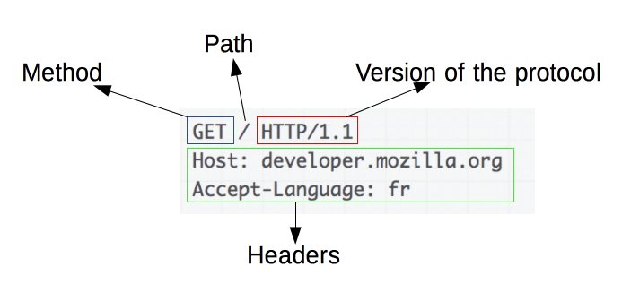

# Hypertext Transfer Protocol (HTTP)


## 1. [Basic aspects of HTTP](https://developer.mozilla.org/en-US/docs/Web/HTTP/Overview#basic_aspects_of_http)


HTTP is an [application-layer](https://en.wikipedia.org/wiki/Application_Layer) protocol for transmitting hypermedia documents, such as HTML.

HTTP is simple, extensible, stateless protocol. HTTP follows a classical [client-server model](https://en.wikipedia.org/wiki/Client–server_model)：requests are sent by one entity, the user-agent (or a proxy on behalf of it). Most of the time the user-agent is a Web browser.


## 2. [HTTP Messages](https://developer.mozilla.org/en-US/docs/Web/HTTP/Overview#http_messages)

- **HTTP Request**



- **HTTP Response**


## 3. [HTTP Methods](https://developer.mozilla.org/en-US/docs/Web/HTTP/Methods)

| Methods | Description                                                  |
| ------- | ------------------------------------------------------------ |
| GET     | requests a representation of the specified resource          |
| POST    | submit an entity to the specified resource                   |
| PUT     | replaces all current representations of the target resource with the request payload |
| DELETE  | deletes the specified resource                               |
| HEAD    | asks for a response identical to that of a `GET` request, but without the response body |
| OPTIONS | describe the communication options for the target resource   |
| TRACE   | performs a message loop-back test along the path to the target resource |
| PATCH   | apply partial modifications to a resource                    |
| CONNECT | establishes a tunnel to the server identified by the target resource |

```http
GET /index.html

POST /test

PUT /new.html HTTP/1.1

DELETE /file.html HTTP/1.1

HEAD /index.html

OPTIONS /index.html HTTP/1.1
OPTIONS * HTTP/1.1

TRACE /index.html

PATCH /file.txt HTTP/1.1

CONNECT www.example.com:443 HTTP/1.1
```


## 4. [Status Codes](https://developer.mozilla.org/en-US/docs/Web/HTTP/Status)

| Status                               | Status codes | Status message                |
| ------------------------------------ | ------------ | ----------------------------- |
| **1XX**  ( Informational Responses ) | **100**      | Continue                      |
|                                      | 101          | Switching Protocols           |
|                                      | 102          | Processing                    |
|                                      | 103          | Early Hints                   |
| **2XX** ( Successful Responses )     | **200**      | OK                            |
|                                      | 201          | Created                       |
|                                      | 202          | Accepted                      |
|                                      | 203          | Non-Authoritative Information |
|                                      | 204          | No Content                    |
|                                      | 205          | Reset Content                 |
|                                      | 206          | Partial Content               |
| **3XX ** ( Redirects )               | **300**      | Multiple Choices              |
|                                      | 301          | Moved Permanently             |
|                                      | 307          | Temporary Redirect            |
|                                      | 308          | Permanent Redirect            |
| **4XX** ( Client Errors )            | **400**      | Bad Request                   |
|                                      | 401          | Unauthorized                  |
|                                      | 402          | Payment Required              |
|                                      | 403          | Forbidden                     |
|                                      | 404          | Not Found                     |
| **5XX** ( Server Errors )            | **500**      | Internal Server Error         |
|                                      | 503          | Service Unavailable           |
|                                      | 504          | Gateway Timeout               |


## 5.  [APIs based on HTTP](https://developer.mozilla.org/en-US/docs/Web/HTTP/Overview#apis_based_on_http)

| APIs based on HTTP                                           | Description                                                  |
| ------------------------------------------------------------ | ------------------------------------------------------------ |
| [`XMLHttpRequest`](https://developer.mozilla.org/en-US/docs/Web/API/XMLHttpRequest) | exchange data between a user agent and a server              |
| [`Fetch API`](https://developer.mozilla.org/en-US/docs/Web/API/Fetch_API) | provides an interface for fetching resources (including across the network) |
| [server-sent events](https://developer.mozilla.org/en-US/docs/Web/API/Server-sent_events) | a one-way service that allows a server to send events to the client, <br />using HTTP as a transport mechanism |


**Reference**

https://developer.mozilla.org/en-US/docs/Web/HTTP

