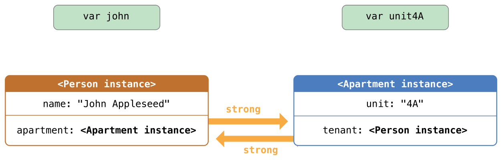

# Automatic Reference Counting

## 1. ARC in Objective-C


## 2. ARC in Swift

Swift uses *Automatic Reference Counting* (ARC) to track and  manage your app’s memory usage. 

ARC automatically frees up the memory used  by class instances when those instances are no longer needed. Reference counting applies only to instances of classes.

### How Automatic Reference Counting works

```swift
//  Define a class called Person
class Person {
    let name: String
    init(name: String) {
        self.name = name
        print("\(name) is being initialized")
    }
    deinit {
        print("\(name) is being deinitialized")
    }
}

//	Declare three optional variables
var reference1: Person?
var reference2: Person?
var reference3: Person?

//	Create a new instance
reference1 = Person(name: "John Appleseed")
// Prints "John Appleseed is being initialized"

//	Create a strong reference of the instance
reference2 = reference1
reference3 = reference1

//	取消强引用
reference1 = nil
reference2 = nil
reference3 = nil
// Prints "John Appleseed is being deinitialized"
```


### Solving Strong Reference Cycles with  Weak or Unowned  References

### Strong Reference Cycles

 If two class instances hold a strong reference to each other, such that  each instance keeps the other alive. This is known as a **strong reference cycle**. 

```swift
//	How a strong reference cycle can be created by accident
class Person {
	let name: String
	init(name: String){ self.name = name }
	var apartment: Apartment?
	deinit {print("\(name) is being deinitialized") }
}//Person

class Apartment {
	let unit: String
	init(unit: String){ self.unit = unit }
	var tenant: Person?
	deinit {print("Apartment \(unit) is being deinitialized")}
}//Apartment

//	Declare variables
var john: Person?
var unit4A: Apartment?

//	Create new instances
john = Person(name: "John Appleseed")
unit4A = Apartment(unit: "4A")

//	Create a strong reference cycle
john!.apartment = unit4A
unit4A!.tenant = john

//   These  instances will never be deallocated
john = nil
unit4A = nil
```


https://docs.swift.org/swift-book/_images/referenceCycle02_2x.png


The strong reference cycle prevents these  instances from ever being deallocated, causing a **memory leak** in your app.

Here’s how the strong references look after you set the `john` and `unit4A` variables to `nil`:



https://docs.swift.org/swift-book/_images/referenceCycle03_2x.png


Swift provides two ways to resolve strong reference cycles when you work with properties of class type: 

- **`weak`** references : when the other instance has a **shorter** lifetime

- **`unowned`** references : when the other instance has the **same** lifetime or a l**onger** lifetime


Person 和 Apartment 示例：两个属性都允许为 nil 时，有可能导致强引用循环，最好使用**弱引用（weak reference.）**来解决。
Customer 和 CreditCard 示例：其中一个的属性允许为nil，另一个的某个属性不能为nil，也有可能导致强引用循环，最好使用**无主引用（unowned reference.）**来解决。


### Weak References

```swift
class Person {
    let name: String
    init(name: String) { self.name = name }
    var apartment: Apartment?
    deinit { print("\(name) is being deinitialized") }
}

class Apartment {
    let unit: String
    init(unit: String) { self.unit = unit }
    weak var tenant: Person?				//	weak references
    deinit { print("Apartment \(unit) is being deinitialized") }
}

var john: Person?
var unit4A: Apartment?

john = Person(name: "John Appleseed")
unit4A = Apartment(unit: "4A")

john!.apartment = unit4A
unit4A!.tenant = john

john = nil
// Prints "John Appleseed is being deinitialized"

unit4A = nil
// Prints "Apartment 4A is being deinitialized"
```


https://docs.swift.org/swift-book/_images/weakReference01_2x.png


https://docs.swift.org/swift-book/_images/weakReference02_2x.png


https://docs.swift.org/swift-book/_images/weakReference03_2x.png


### Unowned References

```swift
class Customer {
    let name: String
    var card: CreditCard?
    init(name: String) {
        self.name = name
    }
    deinit { print("\(name) is being deinitialized") }
}

class CreditCard {
    let number: UInt64
    unowned let customer: Customer	//	unowned references
    init(number: UInt64, customer: Customer) {
        self.number = number
        self.customer = customer
    }
    deinit { print("Card #\(number) is being deinitialized") }
}

var john: Customer?

john = Customer(name: "John Appleseed")
john!.card = CreditCard(number: 1234_5678_9012_3456, customer: john!)

john = nil
// John Appleseed is being deinitialized
// Card #1234567890123456 is being deinitialized
```


https://docs.swift.org/swift-book/_images/unownedReference01_2x.png


https://docs.swift.org/swift-book/_images/unownedReference02_2x.png


#### Unowned Optional References

```swift
class Department {
    var name: String
    var courses: [Course]
    init(name: String) {
        self.name = name
        self.courses = []
    }
}//Department

class Course {
    var name: String
    unowned var department: Department
    unowned var nextCourse: Course?			//	Unowned Optional References
    init(name: String, in department: Department) {
        self.name = name
        self.department = department
        self.nextCourse = nil
    }
}//Course

let department = Department(name: "Horticulture")

let intro = Course(name: "Survey of Plants", in: department)
let intermediate = Course(name: "Growing Common Herbs", in: department)
let advanced = Course(name: "Caring for Tropical Plants", in: department)

intro.nextCourse = intermediate
intermediate.nextCourse = advanced
department.courses = [intro, intermediate, advanced]
```


https://docs.swift.org/swift-book/_images/unownedOptionalReference_2x.png


#### Unowned References and Implicitly Unwrapped Optional Properties

```swift
class Country {
    let name: String
    var capitalCity: City!
    init(name: String, capitalName: String) {
        self.name = name
        self.capitalCity = City(name: capitalName, country: self)
    }
}//Country

class City {
    let name: String
    unowned let country: Country	
    init(name: String, country: Country) {
        self.name = name
        self.country = country
    }
}//City

var country = Country(name: "Canada", capitalName: "Ottawa")
print("\(country.name)'s capital city is called \(country.capitalCity.name)")
// Canada's capital city is called Ottawa
```


### Strong Reference Cycles for Closures

```swift
class HTMLElement {

    let name: String
    let text: String?

    lazy var asHTML: () -> String = {
        if let text = self.text {
            return "<\(self.name)>\(text)</\(self.name)>"
        } else {
            return "<\(self.name) />"
        }
    }//combines name and text into an HTML string fragment

    init(name: String, text: String? = nil) {
        self.name = name
        self.text = text
    }

    deinit {
        print("\(name) is being deinitialized")
    }

}

let heading = HTMLElement(name: "h1")
let defaultText = "some default text"
heading.asHTML = {
    return "<\(heading.name)>\(heading.text ?? defaultText)</\(heading.name)>"
}
print(heading.asHTML())
// Prints "<h1>some default text</h1>"

var paragraph: HTMLElement? = HTMLElement(name: "p", text: "hello, world")
print(paragraph!.asHTML())
// Prints "<p>hello, world</p>"

paragraph = nil
//	The HTMLElement instance isn’t deallocated
```


https://docs.swift.org/swift-book/_images/closureReferenceCycle01_2x.png


**Closure Capture List**

You resolve a strong reference cycle between a closure and a class instance by defining a *capture list* as part of the closure’s definition.

```swift
lazy var someClosure = {
    [unowned self, weak delegate = self.delegate]
    (index: Int, stringToProcess: String) -> String in
    // closure body goes here
}

lazy var someClosure = {
    [unowned self, weak delegate = self.delegate] in
    // closure body goes here
}
```

```swift
class HTMLElement {

    let name: String
    let text: String?

    lazy var asHTML: () -> String = {
        [unowned self] in
        if let text = self.text {
            return "<\(self.name)>\(text)</\(self.name)>"
        } else {
            return "<\(self.name) />"
        }
    }

    init(name: String, text: String? = nil) {
        self.name = name
        self.text = text
    }

    deinit {
        print("\(name) is being deinitialized")
    }

}

var paragraph: HTMLElement? = HTMLElement(name: "p", text: "hello, world")
print(paragraph!.asHTML())
// Prints "<p>hello, world</p>"

paragraph = nil
// Prints "p is being deinitialized"
```


