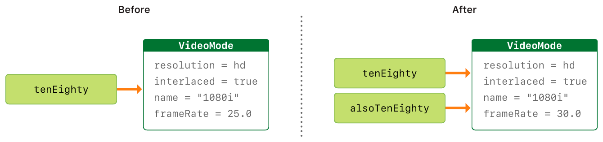

#   Summary of Swift 5.4


## Basics

### 1. Overview

- **print**

  `public func print(_ items: Any..., separator: String = " ", terminator: String = "\n")`

- **`let`** : declare a constant.

- **`var`** : declare a variable.

- **semicolons**  : forget semicolons ( `;` ) if you do not want to write multiple seperate statements on a single line.

  

- **Int** : Int has the same size as the current platform’s native word size.  (min / max properties)

- **Double** : Double is  prefered for  floating-point numbers.

- **Bool** :  true or false.

- **String** :  a series of characters

- **Tuples** : group multiple values into a single compound value.

  

- **Optional** :  You use a optional where a value may be absent. Optional is  **enum** which has two cases :

  - **Optional.none **for nil (he absence of a value)

  - **Optional.some** for a wrapped value. If there is a value, you can unwrap the optional to access the value.

    

- **Collection** 

  -  **Array** : ordered , allowing elements repeated
  - **Dictionary** : key - value pair , unordered
  - **Set** : unordered, no repeated elements, using Set explicitly

  

- **Error Handling**

  `throw`, `do-catch`, `try`

- **Assertions and Preconditions**

  - Debuging with Assertions : call `assert(_:_:file:line:)`
  - Enforcing Preconditions :  call  `precondition(_:_:file:line:)`

  

```swift
print("Hello, world!")						// print() is a global function	

print("Int8: \(Int8.min) ~ \((Int8.max))")	// Int8: -128 ~ 127

// Declare a constant using let
let myConstant = 42						
let implicitDouble = 3.14159			// Type Inference / Type Safety (implicit)
let explicitDouble: Double = 3.14159	// Type Annotations (explicit)

// Declare a variable using var
var myVariable = 23						
myVariable = 45 

// A simpler way to include values in strings: \()
var apple: String = "🍏"
print("Eat an apple\(apple)")				

let myMoney = 11
let yourMoney = 22
let totalMoney = "We have $\(myMoney + yourMoney) now." 
		
var a = 1, b = 2
var sum = "\(a) + \(b) = \(a + b)"	
```

Constants and variable names can be cantain almost any character, including Unicode character.

```swift
// Type Aliases
typealias AudioSample = UInt8
let sample: AudioSample = 32

// Type Conversion
let name: String = "John"	
var age = 18		
var basicInfo = name + " is " + String(age) + " years old." 

//  Downcasting
as! - forced form
as? - conditional form
```


### 2. Operator

| Operators             | Classification       | Remarks                                                      |
| --------------------- | -------------------- | ------------------------------------------------------------ |
| `=`                   | Assignment           | Compound Assignment  Operators like `+=`, `*=`.              |
| `+ - * / `            | Arithmetic           | Don’t allow values to overflow by default.                   |
| `%`                   | Remainder            | `a % b` and `a % -b` are the same.                           |
| `+ -`                 | Unary plus / minus   | `+a` , `-b`                                                  |
| `== != > >= < <=`     | Comparison           | `== !=`                                                      |
| `=== !===`            | Identify             | If two constants or variables refer to the same single instance |
| `a ? b : c`           | Ternary  Conditional | Shorthand for `if-else`                                      |
| `??`                  | Nil - Coalescing     | Shorthand for `a != nil ? a! : b`                            |
| `a…b  a..<b  a… or…b` | Range                |                                                              |
| `&& || !`             | `Logical`            | Combine: Logical AND,  Logical OR,  Logical NOT              |
| `()`                  | Explicit Parentheses |                                                              |
| `&  |  ~  ^  <<  >>`  | Bitwise              | AND, OR, NOT,  XOR, Left Shift, Right Shift                  |
| `&+  &-  &*`          | Overflow             |                                                              |
| `? !`                 | Optional             |                                                              |
| `is` `as`             | Type Casting         |                                                              |

- Unary operators : `-a`, `!b`, `c!`
- Binary operators : `a + b`
- Ternary operators: `a ? b : c`
- Precedence 
- Associativity

```swift
// Remainder Operator
7 % 3     // 1
7 % -3	 // 1
-7 % 3	// -1

// Combine logical operators and use explicit parentheses
if (enteredDoorCode && passedRetinaScan) || hasDoorKey || knowsOverridePassword {
    print("Welcome!")
} else {
    print("ACCESS DENIED")
}
```

```swift
// Overloading the existing operators (classes and structures)


// Declare and implement your own custom operators using keyword operator 
prefex operator +++

//	Result builder
```


### 3. Literal

```swift
// Int
let decimalInteger = 17
let binaryInteger = 0b10001      
let octalInteger = 0o21          
let hexadecimalInteger = 0x11

// Double
let decimalDouble = 12.1875
let exponentDouble = 1.21875e1
let hexadecimalDouble = 0xC.3p0

// Readable
let paddedDouble = 000123.456
let oneMillion = 1_000_000
let justOverOneMillion = 1_000_000.000_000_1
```


### 4.String

```swift
// Create a empty string
var emptyString = ""  		
var anotherEmptyString = String()

//	Declare a String constant
let myFruit = "Cherry"
var numberOfMyFruit = 3
let yourFruit = "apple"

//	isEmpty, count property
if myFruit.isEmpty {
    print("Empty")
} else {
    print(myFruit.count)
}

//	for-in
for character in myFruit {
    print(character)
}

//	string interpolation
print("\(myFruit):\(numberOfMyFruit)")

//	+, =+, append()
var fruit = myFruit + " " + yourFruit
fruit += " banana"
fruit.append("peach")


//	Multiline string literal using three double quotation marks (""")
let dialoge = """
	Hi, how are you?
	I'm fine. Thank you.
	And you? 
"""
```

- **String Indices**

  `startIndex, endIndex,` `index(before: ), index(after: ), index(_:offsetBy: )`

```swift
let greeting = "Hello, guys!"
greeting[greeting.startIndex]                                    // H
greeting[greeting.index(before: greeting.endIndex)]        // !
greeting[greeting.index(after: greeting.startIndex)]        // e
let index = greeting.index(greeting.startIndex, offsetBy: 9)    // y
greeting[index]

// newGreeting[newGreeting.endIndex]
// newGreeting.index(after: newGreeting.endIndex)
// Fatal error: String index is out of bounds

for index in greeting.indices {
    print("\(greeting[index]) ", terminator: "")
}
```

- **Inserting and Removing**

  `insert(_:at: )`,  `insert(contentsOf:at:) `, `remove(at: )` , `*removeSubrange(_: )`

```swift
var doctor = "Joh"
doctor.insert("n", at: doctor.endIndex)
// John

doctor.insert(contentsOf: "son", at: doctor.index(doctor.endIndex, offsetBy: 0))
// Johnson
doctor.remove(at: doctor.index(doctor.startIndex, offsetBy: 4))
print(doctor)
// Johnon

let range = doctor.index(doctor.endIndex, offsetBy: -2)..<doctor.endIndex
doctor.removeSubrange(range)
// John
```


- SubString

```swift
let bookAndAuthor = "Relativity, Einstein"
let newIndex = bookAndAuthor.firstIndex(of: ",") ?? bookAndAuthor.endIndex
let beginning = bookAndAuthor[..<newIndex]
let newString = String(beginning)			// the persistence storeage of a subString
```


- Compare two strings

  `==` ,  `!=` , `hasPrefix(\_: )`, `hasSuffix(\_: )`

```swift
let firstWord = "actor"
let secondWord = "actress"

if firstWord == secondWord {
     print("They are the same")
} else {
    print("They are different.")
}


let myArray = ["act","active","actor","worker","teacher","engineer","waiter"]
var actPrefixCount = 0
var erSuffixCount = 0

for word in myArray {
    if word.hasPrefix("act") {
        actPrefixCount += 1
    }
}


for word in myArray {
    if word.hasSuffix("er") {
        erSuffixCount += 1
    }
}
```


- Unicode Scalar Values and  Extended Grapheme Clusters

```swift
/* Unicode Scalar Values */
print("\u{0061}")			//	a
print("\u{1F425}")			//  🐥

/* Extended Grapheme Clusters */
let eAcute: Character = "\u{E9}"                         
let combinedEAcute: Character = "\u{65}\u{301}" 
let enclosedEAcute: Character = "\u{E9}\u{20DD}" 
let regionalIndicatorForUS: Character = "\u{1F1FA}\u{1F1F8}"
```


### 5. Tuple

```swift
// Tuple
let myMagicalNumber = (number:42, description:"Magical Number")

print("\(myMagicalNumber.0): \(myMagicalNumber.1)")
print("\(myMagicalNumber.number): \(myMagicalNumber.description)")

let (num,msg) = myMagicalNumber
print("\(num): \(msg)")

let (justNumber,_) = myMagicalNumber
print("\(justNumber)")
```

```swift
//	getArticleInfo：a method with argument and multiple return value
class Book { 
  	func getArticleInfo(author: String) -> (id: Int, title: String, category: String) 		
    { 
  		var id = 42, title = "Lost and Found", category = "fiction" 
  		switch author { 
   	 		case "Johnson": 
    			id = 41 
    			title = "My Best Friend" 
    			category = "biography"
    		case "Adam": 
    			id = 42 
    			title = "Lost and Found" 
    			category = "fiction" 
   	 		default: 
    			break
  		}
 		 	return (id, title, category)
	} 
}

//	call getArticleInfo()
let book = Book() 
let article = book.getArticleInfo(author: "Johnson") 
print("id : \(article.id)") 
print("title : \(article.title)") 
print("category : \(article.category)")
```


### 6. Optional

````swift
//	Declare a Optional variable using ? or Optional
var name: String? = "Adam"

//	Forced Unwrapping  Using ! 
if name != nil {
    print("Hello,\(name!)")
}

//	Optional Binding - if let, guard let, and switch
var optionalName: String? = "John"
if let constantName = optionalName {
    print("Hello, \(constantName)")
}

//	Implicity Unwrapped Optional
var name: String! = "Adam"
print("Hello,\(name!)")

//	Optional Chaining
var myString: String? = "hello"
let count = myString?.count

if count != nil {
    let lastIndex = count! - 1
    print(lastIndex)
}

// 	Nil-Coalescing Operator ??
let nickName: String? = nil
let greeting = "Hi, \(nickName ?? "Shaun Murphy")"
````


### 7. Collection Types


Image from <https://docs.swift.org/swift-book/_images/CollectionTypes_intro_2x.png>


#### Array

```swift
// Cteate an array (ordered , allowing elements repeated)
var emptyArray = [String]()
var anotherArray = Array(repeating: 0.0, count: 3)

var myFruits = ["apple","banana"]
var yourFruits = ["orange", "banana"]
var fruits = myFruits + yourFruits

//	isEmpty, count 
if fruits.isEmpty {
    print("Empty")
} else {
    print(fruits.count)
}

//	append(), +=, [index], insert()
fruits.append("cherry")
fruits += ["peach"]
fruits[1...3] = ["grape","watermelon","peal"]
fruits.insert("pineapple",at:6)

//	remove(), removeLast()
fruits.remove(at:1)
fruits.removeLast()


//	for-in
for fruit in fruits {
    print(fruit)
}

//	enumerator()
for (index,value) in fruits.enumerated() {
    print("Element \( index + 1 ): \(value)")
}
```


#### Dictionary

```swift
// Cteate a dictionary ( key - value pair , unordered)
let emptyDictionary = [String: Float]()

var fruitsForSale = ["apple": 1.1, "banana": 2.2,"orange": 3.3]

//    isEmpty, count
if !fruitsForSale.isEmpty {
    print("The shop has \(fruitsForSale.count) fruits for sale now.")
}

//    updateValue(), removeValue()
fruitsForSale["pineapple"] = 4.4
fruitsForSale.updateValue(5.5, forKey: "watermelon")
fruitsForSale.removeValue(forKey: "orange")

if let oldValue = fruitsForSale.updateValue(6.6, forKey: "watermelon"){
    print("The old value of key watermelon is \(oldValue)")
}

// for-in
for (fruit, price) in fruitsForSale {
    print("\(fruit) :\(price)")
}

//  keys and values property , sorted()
for fruit in fruitsForSale.keys.sorted() {
  print("\(fruit)")
}
for price in fruitsForSale.values {
  print("\(price)")
}

//    get or set the value using subscript
let currentPricrForBanana = fruitsForSale["banana"]
fruitsForSale["banana"] = 10.0
fruitsForSale["cherry"] = 42.0

/*	Use the keys or values property to initialize a new array when you need to use a 	dictionary’s keys or values with an API that takes an Array instance.
*/
var numToEnglish = [1:"one", 2:"two", 3:"three"]
let num = [Int](numToEnglish.keys)
let englishNum = [String](numToEnglish.values)
```

#### Set

```swift
//    Create a set using Set (unordered, no repeated elements)
var colors = Set<String>()
var myColors: Set<String> = ["red","green","blue"]
var yourColors: Set = ["red","green","orange"]

//    isEmpty, count
if !myColors.isEmpty {
    print("I have \(myColors.count) colors.")
}

//     for-in
for color in myColors {
    print(color)
}

//    contains()
if myColors.contains("blue") {
    print("I have blue color already.")
}

//    insert()
myColors.insert("yellow")

//    intersection()
myColors.intersection(yourColors)

//    symmetricDifference()
myColors.symmetricDifference(yourColors)

//    sorted()
for color in myColors.sorted() {
    print("\(color)")
}
```


Image from <https://docs.swift.org/swift-book/_images/setVennDiagram_2x.png>

```swift
//	Fundmental Set Operations
let oddDigits: Set = [1, 3, 5, 7, 9]
let evenDigits: Set = [0, 2, 4, 6, 8]
let singleDigitPrimeNumbers: Set = [2, 3, 5, 7]

oddDigits.union(evenDigits).sorted()			// [0, 1, 2, 3, 4, 5, 6, 7, 8, 9]
oddDigits.intersection(evenDigits).sorted()							// []
oddDigits.subtracting(singleDigitPrimeNumbers).sorted()				// [1, 9]
oddDigits.symmetricDifference(singleDigitPrimeNumbers).sorted()		// [1, 2, 9]
```


Image from <https://docs.swift.org/swift-book/_images/setEulerDiagram_2x.png>

```swift
//	Set Membership and Equality
let numSet1: Set = [1,2,3,4,5,6]
let numSet2: Set = [1,3,5]
let numSet3: Set = [2,4,6]

numSet1.isSubset(of: numSet2)           //  false
numSet2.isStrictSubset(of: numSet1)     //  true
numSet1.isSuperset(of: numSet2)         //  true
numSet2.isDisjoint(with: numSet3)       //  true
```


### 8. Control Flow

#### Loop

- **for-in**

```swift
// for-in where 
let numbers = [6, 6, 7, 8, 5, 32, 66, 99]
for number in numbers where number % 2 == 0 {
  print(number)
}

//	Print Product Table 
for x in 1...9 {
    for y in 1...x{
        print("\(y) * \(x) = \(y * x)   ",terminator: "")
        if ( x == y) {
            print("\n")
        }
    }
}


//	stride(from:to:by:)
let minutes = 60
let minuteInterval = 5
for tickMark in stride(from: 0, to: minutes, by: minuteInterval) {
    print(tickMark)
}// 0, 5, 10, 15 ... 45, 50, 55


//	stride(from:through:by:)
let hours = 12
let hourInterval = 3
for tickMark in stride(from: 3, through: hours, by: hourInterval) {
    print(tickMark)
}//3, 6, 9, 12
```

- **while, repeat while**

```swift
// while
var n = 2
while n < 2 {
    n *= 2
}
print(n)				//  2

// repeat-while
var m = 2
repeat {
    m *= 2
} while m < 2
print(m)				// 4
```


#### Condition

- **if**,  **if-else**,  **if-let**

```swift
// if-let

var name: String?
if let constantName = name {
    print("Hello, \(constantName)")
}//Do nothing

name = "Johnson"
if let constantName = name {
    print("Hello, \(constantName)")
}//Print "Hello, Johnson"
```

- **switch**

```swift
//	switch statement (exhaustive)
switch someValue to consider {
    case value 1:
    	respond to value 1
    //	Compound Cases (with a comma)
    case value 2, value 3:
    	respond to value 2 or value 3 
    default:
    	otherwise, do something else
}

//	No implicit Fallthrough for safer code
let character: Character = "h"
switch character {
    case "h":		//	Invalid (a compile-time error)
    case "H":
        print("The letter H")
    default:
        print("Not the letter H")
}

//	Interval Matching
let number = 85
switch number {
    case 0..<60:
        print("Failed")
    case 60..<70:
        print("Passed")
    case 70..<85:
    	print("Passed")
    case 85..<100:
        print("Very Good")
    case 100:
        print("Perfect")
    default:
        print("May be you did not choose this course before.")
}

//	Tuples, Value Bindings, where
let point = (1,0)
switch point {
    case (let x, 0):
    	print("on the x-axis with x value of \(x)")
    case (0, let y):
    	print("on the y-axis with y value of \(y)")
    case (let x, let y) where x == y:
    	print("(\(x),\(y)) is on the line x == y")
    case (let x, let y) where x == -y:
    	print("(\(x),\(y)) is on the line x == -y")
    case (let x, let y):
    	print("(\(x),\(y)) is just some arbutary point")
}
```

- **guard**

```swift
guard else {
		//	Do something if the conditions are not met
}
// Do other things
```


- **Control Transfer Statements**

```swift
// continue
let stringInput = "an apple a day keeps the disease away"
let charactersToRemove: [Character] = ["a","e","i","o","u", " "]
var stringOuyput = ""

for character in stringInput {
    if charactersToRemove.contains(character) {
        continue
    }
    stringOuyput.append(character)
}
print(stringOuyput)

//	break
let numberSymbol: Character = "三"  // Chinese symbol for the number 3
var possibleIntegerValue: Int?
switch numberSymbol {
case "1", "١", "一", "๑":
    possibleIntegerValue = 1
case "2", "٢", "二", "๒":
    possibleIntegerValue = 2
case "3", "٣", "三", "๓":
    possibleIntegerValue = 3
case "4", "٤", "四", "๔":
    possibleIntegerValue = 4
default:
    break
}
if let integerValue = possibleIntegerValue {
    print("The integer value of \(numberSymbol) is \(integerValue).")
} else {
    print("An integer value couldn't be found for \(numberSymbol).")
}
// Prints "The integer value of 三 is 3."


//	fallthrough
let integerToDescribe = 5
var description = "The number \(integerToDescribe) is"
switch integerToDescribe {
case 2, 3, 5, 7, 11, 13, 17, 19:
    description += " a prime number, and also"
    fallthrough
default:
    description += " an integer."
}
print(description)
// Prints "The number 5 is a prime number, and also an integer."
```

**return** : Function

**Throw**: Propagating Errors Using Throwing Functions

- Labeled Statements

```swift
label name: while condition {
    statements
}
```


#### Availability Checking

```swift
if #available(platform name version, ..., *) {
    statements to execute if the APIs are available
} else {
    fallback statements to execute if the APIs are unavailable
}

//	Use if statement
if #available(iOS 11.0, *) { 
  // not lower than iOS 11
  let view = UIView() 
  let layoutGuide = view.safeAreaLayoutGuide 
} else {
  // Early iOS version 
}

//	2. Use guard statement
guard #available(iOS 11.0, *) else {
  // Do something if the minimum OS version requirements are not met
  return 
}
let view = UIView()
let layoutGuide = view.safeAreaLayoutGuide

//	3. Specify AwesomeClass only applies to iOS 12 and above
@available(iOS 13.0, *) 
class AwesomeClass { 
  // 
}
```


## Generics

```swift
// Generic Function : Placeholder Type T
func funcName<T>(a:T, b:T){
  //do something
}

// Protocol Constraint 
func isEqual<T: Equatable>(a: T, b: T) -> Bool {
  return a == b
}

isEqual(a:4, b:4)				//true
isEqual(a:"hello", b:"hi")		//false
isEqual(a:3.1415926, b:2.718) 	//false

// Gerneric Types 
```


## Function and Closure

### Functions

#### Defining and Calling Functions

```swift
//  Functions Without Parameters, With an Implicit Return (Without return keyword)
func greet() -> String {
    "Hello"
}
print(greet())


//  Functions Without Return Values
func sayHi(to name:String) {
    print("Hi, \(name)")
}
sayHi(to: "Jhonson")


//  Functions With Multiple Parameters
func getGreatBook(book: String, author: String) -> String {
    let info = "\(book), writted by \(author)"
    return info
}

var greatBook = getGreatBook(book: "How to become a awesome developer", author: "Johnson")
print(greatBook)


//  Functions With Multiple Return Values (Tuple, Optional, Optional Binding)
func getmMinMax(array: [Double]) -> (min: Double, max: Double)? {
    if array.isEmpty {return nil}
    var currentMin = array[0]
    var currentMax = array[0]
    for value in array[1..<array.count] {
        if value < currentMin {
            currentMin = value
        } else if value > currentMax {
            currentMax = value
        }
    }
    return (currentMin, currentMax)
}

if let bounds = getmMinMax(array: [1.0,2.0,3.0,4.0]) {
    print(bounds)
}
```

#### Argument Labels and Parameter Names

```swift
//  Function Argument Labels and Parameter Names
func greet(person name: String, from hometown: String) -> String {
    return "Hi,\(name), Glad you could visit from \(hometown) "
}

print(greet(person: "Johnson", from: "London"))


//  Omintting Argument Labels
func greet(_ name: String, from hometown: String) -> String {
    return "Hi,\(name), Glad you could visit from \(hometown) "
}

print(greet("Johnson", from: "London"))


//  Default Parameter Values
func getKelvinTemperature(zeroCelsius : Double = 273.15, currentCelsius: Double) -> String {
    return "\(currentCelsius) ℃ is \(currentCelsius + zeroCelsius) K"
}
getKelvinTemperature(currentCelsius: 5)
getKelvinTemperature(zeroCelsius : 11, currentCelsius: 5)

func getRealKelvin(currentCelsius: Double) -> String {
    let zeroCelsius = 273.15
    return "\(currentCelsius) ℃ is \(currentCelsius + zeroCelsius) K"
}
getRealKelvin(currentCelsius: 5)


//  Variadic Parameters
func arithmeticMean(_ numbers: Double...) -> Double {
    var total: Double = 0
    for number in numbers {
        total += number
    }
    return total / Double(numbers.count)
}
arithmeticMean(2, 3, 4, 5, 6)   // 4
arithmeticMean(1.1, 2.2, 3.3)  // 2.2


//  In-Out Parameters - modify the value of a parameter and make the change persist
func swap(_ a: inout Double, _ b: inout Double) {
    let temporaryA = a
    a = b
    b = temporaryA
}

var firstNumber = 3.14159
var secondNumber = 2.71828
print("Before: firstNumber : \(firstNumber), secondNumber : \(secondNumber)")
//  Before: firstNumber : 3.14159, secondNumber : 2.71828

swap(&firstNumber, &secondNumber)
print("After : firstNumber : \(firstNumber), secondNumber : \(secondNumber)")
//  firstNumber : 2.71828, secondNumber : 3.14159
```


####  Function Types

```swift
//  Function types : (Double, Double) -> Double
func addTwoNumbers(_ a: Double, _ b: Double) -> Double {
    return a + b
}


//  Using Function types
var mathFunction: (Double, Double) -> Double = addTwoNumbers
print("Result: \(mathFunction(1.0, 2.0))")


//  Function is first-class type: function types as parameter types 
func printMathResult(_ mathFunction: (Double, Double) -> Double, a: Double, b: Double) {
    print("Result: \(mathFunction(a, b))")
}

printMathResult(addTwoNumbers, a: 3.0, b: 5.0)

//  Function is first-class type: function types as return types
//	Nested functions

func chooseStepFunction(backward: Bool)-> (Int) -> Int {
    
    func stepForward(_ input: Int) -> Int { return input + 1 }
    
    func stepBackward(_ input: Int) -> Int { return input - 1 }
    
    return backward ? stepBackward : stepForward
}

var currentValue = 3
let moveNearerToZero = chooseStepFunction(backward: currentValue > 0)

print("Counting to zero")

while currentValue != 0 {
    print("\(currentValue)...")
    currentValue = moveNearerToZero(currentValue)
}
print("zero!")
```


### Closure

| Forms of Closure   | Name | Value capture                                 |
| ------------------ | ---- | --------------------------------------------- |
| Global functions   | Yes  | No                                            |
| Nested functions   | Yes  | Capture values from their enclosing function  |
| Closure Expression | No   | Capture values from their surrounding context |

#### Closure Expression

```swift
//	Closure Expression
{(parameters) -> return type in
	statements
}

// sorted(by:)
let names = ["Chris", "Alex", "Ewa", "Barry", "Daniella"]

//	1 - Using function
func backward(_ s1: String, _ s2: String) -> Bool {
    return s1 > s2
}
var reversedNames = names.sorted(by: backward)

//	2 - Using closure expression
reversedNames = names.sorted(by: { (s1: String, s2: String) -> Bool in 
	return s1 > s2 
})

//	Inferring type from context
reversedNames = names.sorted(by: { s1, s2 in return s1 > s2 } )

//	Implicit returns from single-expression closures
reversedNames = names.sorted(by: { s1, s2 in s1 > s2 } )


//	Shorthand argument names to inline closures:  $0, $1, $2, ...
reversedNames = names.sorted(by: { $0 > $1 } )

//	Operator methods
reversedNames = names.sorted(by: >)
```

#### Trailing Closures

When you need to pass a closure expression to a function as the function’s final argument,  and the closure expression is long, use a trailing closures.

```swift
func someFunctionThatTakesAClosure(closure: () -> Void) {
    // function body
}

//	Calling without trailing closure

someFunctionThatTakesAClosure(closure: {
    // closure's body
})

// Calling without trailing closure

someFunctionThatTakesAClosure() {
    // trailing closure's body
}

//	Written outside of the sorted(by:) method’s parentheses as a trailing closure
reversedNames = names.sorted(){ $0 > $1 } 

//	 when a trailing closure is the function’s or method’s only argument
reversedNames = names.sorted{$0 > $1}
```

````swift
let digitNames = [
    0: "Zero", 1: "One", 2: "Two",   3: "Three", 4: "Four",
    5: "Five", 6: "Six", 7: "Seven", 8: "Eight", 9: "Nine"
]
let numbers = [16, 58, 510]

let strings = numbers.map { (number) -> String in
    var number = number
    var output = ""
    repeat {
        output = digitNames[number % 10]! + output
        number /= 10
    } while number > 0
    return output
}
````

#### Capturing Values

A closure can *capture* constants and variables from the surrounding context in which it’s defined.

In Swift, the simplest form of a closure that can capture values is a nested function.

```swift
//	Capturing Values
func makeIncrementer(forIncrement amount: Int) -> () -> Int {
    var runningTotal = 0
    func incrementer() -> Int {
        runningTotal += amount
        return runningTotal
    }
    return incrementer
}

//	
let incrementByThree = makeIncrementer(forIncrement: 3)
incrementByThree()        //  3
incrementByThree()        //  6
incrementByThree()        //  9

let incrementByFive = makeIncrementer(forIncrement: 5)
incrementByFive()           //  5
incrementByFive()           //  10
incrementByThree()          //  12
```

#### Closures Are Reference Types

Functions and closures are **reference types**. Whenever you assign a function or a closure to a constant or a variable, you are actually setting that constant or variable to be a *reference* to the function or closure. 

```swift
let alsoIncrementByThree = incrementByThree
alsoIncrementByThree()      //  15
incrementByThree()          //  18
```

#### Escaping Closures

A closure is said to *escape* a function when the closure is passed as an argument to the function, but is called after the function returns.

```swift
var completionHandlers = [() -> Void]()
func someFunctionWithEscapingClosure(completionHandler: @escaping () -> Void) {
    completionHandlers.append(completionHandler)
}
```

If you want to capture `self`, write `self` explicitly when you use it, or include `self` in the closure’s capture list. Writing `self` explicitly lets you express your intent, and reminds you to confirm that there isn’t a reference cycle.

```swift
func someFunctionWithNonescapingClosure(closure: () -> Void) {
    closure()
}

class SomeClass {
    var x = 10
    func doSomething() {
        someFunctionWithEscapingClosure { self.x = 100 }
        someFunctionWithNonescapingClosure { x = 200 }
    }
}

let instance = SomeClass()
instance.doSomething()
print(instance.x)
// Prints "200"

completionHandlers.first?()
print(instance.x)
// Prints "100"

class SomeOtherClass {
    var x = 10
    func doSomething() {
        someFunctionWithEscapingClosure { [self] in x = 100 }
        someFunctionWithNonescapingClosure { x = 200 }
    }
}
struct SomeStruct {
    var x = 10
    mutating func doSomething() {
        someFunctionWithNonescapingClosure { x = 200 }  // Ok
        someFunctionWithEscapingClosure { x = 100 }     // Error
    }
    }
```

#### Autoclosures

A closure that’s automatically created to wrap an expression that’s being passed as an argument to a function. 

```swift
var customersInLine = ["Chris", "Alex", "Ewa", "Barry", "Daniella"]
print(customersInLine.count)
// Prints "5"

let customerProvider = { customersInLine.remove(at: 0) }
print(customersInLine.count)
// Prints "5"

print("Now serving \(customerProvider())!")
// Prints "Now serving Chris!"
print(customersInLine.count)
// Prints "4"
```


## OOP

### Enumerations、Structures and Classes

| Type           | Description                                       | Example      |
| -------------- | ------------------------------------------------- | ------------ |
| Value Type     | a copy                                            | enum, struct |
| Reference Type | a reference to the same existing instance is used | class        |

All of the basic types in Swift—integers, floating-point numbers,  Booleans, strings, arrays and dictionaries—are value types, and are  implemented as structures behind the scenes.

All structures and enumerations are value types in Swift.

Structures and classes in Swift have many things in common. Both can:

- Define properties to store values
- Define methods to provide functionality
- Define subscripts to provide access to their values using subscript syntax
- Define initializers to set up their initial state
- Be extended to expand their functionality beyond a default implementation
- Conform to protocols to provide standard functionality of a certain kind

For more information, see [Properties](https://docs.swift.org/swift-book/LanguageGuide/Properties.html), [Methods](https://docs.swift.org/swift-book/LanguageGuide/Methods.html), [Subscripts](https://docs.swift.org/swift-book/LanguageGuide/Subscripts.html), [Initialization](https://docs.swift.org/swift-book/LanguageGuide/Initialization.html), [Extensions](https://docs.swift.org/swift-book/LanguageGuide/Extensions.html), and [Protocols](https://docs.swift.org/swift-book/LanguageGuide/Protocols.html).

Classes have additional capabilities that structures don’t have:

- Inheritance enables one class to inherit the characteristics of another.
- Type casting enables you to check and interpret the type of a class instance at runtime.
- Deinitializers enable an instance of a class to free up any resources it has assigned.
- Reference counting allows more than one reference to a class instance.

For more information, see [Inheritance](https://docs.swift.org/swift-book/LanguageGuide/Inheritance.html), [Type Casting](https://docs.swift.org/swift-book/LanguageGuide/TypeCasting.html), [Deinitialization](https://docs.swift.org/swift-book/LanguageGuide/Deinitialization.html), and [Automatic Reference Counting](https://docs.swift.org/swift-book/LanguageGuide/AutomaticReferenceCounting.html).

[Choosing Between Structures and Classes](https://developer.apple.com/documentation/swift/choosing_between_structures_and_classes)

Decide how to store data and model behavior:

Use structures by default, Use structures along with protocols to adopt behavior by sharing implementations. Swift structures :

- is value types
- include stored properties, computed properties, and methods.  
- adopt protocols to gain behavior through  default implementations. 
- The Swift standard library and Foundation use  structures for types you use frequently, such as numbers, strings,  arrays, and dictionaries.

Use **classes** when you need **Objective-C** interoperability, or control the **identity** of the data you're modeling.


#### Enumerations

```swift
enum CompassPoint: String {
	case north, south, east, west
}

var directionToHead = CompassPoint.west
directionToHead = CompassPoint.east

//	Matching Enumeration Values with a Switch Statement
switch directionToHead {
case .north:
    print("North")
case .south:
    print("South")
case .east:
    print("East")
case .west:
    print("West")
}

enum Planet {
    case mercury, venus, earth, mars, jupiter, saturn, uranus, neptune
}

//	Provide a default case to cover any cases that aren’t addressed explicitly
let somePlanet = Planet.venus
switch somePlanet {
case .earth:
    print("The planet we live in.")
case .mars:
    print("The planet we wanna go.")
default:
    print("Not a good choice.")
}
```

#### Iterating over Enumeration Cases

```swift
//	Conform to CaseIterable or use for-in loop
enum LanguageVersion: CaseIterable {
    case English, Chinese, French, Japanese
}
let numberOfChoices = LanguageVersion.allCases.count
print("There are \(numberOfChoices) languages are available.")

for language in LanguageVersion.allCases {
    print(language)
}
```

#### Associated Values

```swift
enum Barcode {
    case upc(Int, Int, Int, Int)
    case qrCode(String)
}

var productBarcode = Barcode.upc(8, 85909, 51226, 3)
productBarcode = .qrCode("ABCDEFGHIJKLMNOP")

switch productBarcode {
case .upc(let numberSystem, let manufacturer, let product, let check):
    print("UPC: \(numberSystem), \(manufacturer), \(product), \(check).")
case .qrCode(let productCode):
    print("QR code: \(productCode).")
}

switch productBarcode {
case let .upc(numberSystem, manufacturer, product, check):
    print("UPC : \(numberSystem), \(manufacturer), \(product), \(check).")
case let .qrCode(productCode):
    print("QR code: \(productCode).")
}
```

#### Raw Values

```swift
//	Default values
enum ASCIIControlCharacter: Character {
    case tab = "\t"
    case lineFeed = "\n"
    case carriageReturn = "\r"
}

//	Implicitly Assigned Raw Values
enum Planet: Int {
    case mercury = 1, venus, earth, mars, jupiter, saturn, uranus, neptune
}
let earthsOrder = Planet.earth.rawValue				//	3

enum CompassPoint: String {
    case north, south, east, west
}
let sunsetDirection = CompassPoint.west.rawValue	//	west

//	Initializing from a Raw Value
let possiblePlanet = Planet(rawValue: 7)
print(possiblePlanet)
//	Optional(__lldb_expr_691.Planet.uranus)

let positionToFind = 11
if let somePlanet = Planet(rawValue: positionToFind) {
    switch somePlanet {
    case .earth:
        print("Mostly harmless")
    default:
        print("Not a safe place for humans")
    }
} else {
    print("There isn't a planet at position \(positionToFind)")
}
// Prints "There isn't a planet at position 11"
```

#### Recursive Enumerations

```swift
//	Write like this
enum ArithmeticExpression {
    case number(Int)
    indirect case addition(ArithmeticExpression, ArithmeticExpression)
    indirect case multiplication(ArithmeticExpression, ArithmeticExpression)
}

//	Or write like this
indirect enum ArithmeticExpression {
    case number(Int)
    case addition(ArithmeticExpression, ArithmeticExpression)
    case multiplication(ArithmeticExpression, ArithmeticExpression)
}

let five = ArithmeticExpression.number(5)
let four = ArithmeticExpression.number(4)
let sum = ArithmeticExpression.addition(five, four)
let product = ArithmeticExpression.multiplication(sum, ArithmeticExpression.number(2))

func evaluate(_ expression: ArithmeticExpression) -> Int {
    switch expression {
    case let .number(value):
        return value
    case let .addition(left, right):
        return evaluate(left) + evaluate(right)
    case let .multiplication(left, right):
        return evaluate(left) * evaluate(right)
    }
}

print(evaluate(product))
// Prints "18"
```

### Structures

```swift
//	Definition Syntax
struct Resolution {
    var width = 0
    var height = 0
}

//	Structure  Instances
let someResolution = Resolution()

//	Accessing Properties Using Dot Syntax
print("The width of someResolution is \(someResolution.width)")

//	Memberwise Initializers for Structure Types
let vga = Resolution(width: 640, height: 480)
```

#### Structures and Enumerations Are Value Types

```swift
//	Structures
let hd = Resolution(width: 1920, height: 1080)
var cinema = hd
cinema.width = 2048
print("cinema is now \(cinema.width) pixels wide")	//	2048
print("hd is still \(hd.width) pixels wide")		//	1920

//	 Enumerations
enum CompassPoint {
    case north, south, east, west
    mutating func turnNorth() {
        self = .north
    }
}
var currentDirection = CompassPoint.west
let rememberedDirection = currentDirection
currentDirection.turnNorth()

print("The current direction is \(currentDirection)")
print("The remembered direction is \(rememberedDirection)")
```


Image from <https://docs.swift.org/swift-book/_images/sharedStateStruct_2x.png>

### Classes

```swift
//	Definition Syntax
struct Resolution {
    var width = 0
    var height = 0
}

class VideoMode {
    var resolution = Resolution()
    var interlaced = false
    var frameRate = 0.0
    var name: String?
}

//	Class Instances 
let someVideoMode = VideoMode()

//	Accessing Properties Using Dot Syntax
print("The width of someVideoMode is \(someVideoMode.resolution.width)")
someVideoMode.resolution.width = 1280
print("The width of someVideoMode is now \(someVideoMode.resolution.width)")

//	Classes Are Reference Types
let hd = Resolution(width: 1920, height: 1080)
let tenEighty = VideoMode()
tenEighty.resolution = hd
tenEighty.interlaced = true
tenEighty.name = "1080i"
tenEighty.frameRate = 25.0

let alsoTenEighty = tenEighty
alsoTenEighty.frameRate = 30.0

print("The frameRate property of tenEighty is now \(tenEighty.frameRate)")	//	30

//	 Identity Operators
if tenEighty === alsoTenEighty {
    print("tenEighty and alsoTenEighty refer to the same VideoMode instance.")
}
```

Because classes are reference types, tenEighty and alsoTenEighty actually both refer to the same VideoMode instance. Effectively, they’re just two different names for the same single instance.



Image from <https://docs.swift.org/swift-book/_images/sharedStateClass_2x.png>


Use the following two identity operators to find out  Whether two constants or variables refer to exactly the same instance of a class.

-  Identical to (`===`)
- Not identical to (`!==`) 

```swift
// class
class Tool {
    var productID: Int?
    var name: String?
    var manufacturer: String?
    var price: Double?
    var usage: String?
}


// instance, dot syntax
var developTool = Tool()
developTool.productID = 123456
developTool.name = "Woobook Pro"
developTool.manufacturer = "ABC Inc."
developTool.price = 12345.6
developTool.description = "Build Code, Enjoy Life."

class SimpleTableViewController : UIViewController, UITableViewDelegate, UITableVi ewDataSource
```

### Properties

#### Stored Properties

```swift
//	Stored Properties
struct FixedLengthRange {
    var firstValue: Int
    let length: Int
}
var rangeOfThreeItems = FixedLengthRange(firstValue: 0, length: 3)	//	0, 1, 2
rangeOfThreeItems.firstValue = 6									//	6, 7, 8

//	Stored Properties of Constant Structure Instances
let rangeOfFourItems = FixedLengthRange(firstValue: 0, length: 4)

//	Lazy Stored Properties
class DataImport {
    var filename = "data.txt"
    // data importing functionality
}

class DataManager {
    lazy var importer =  DataImport()
    var data = [String]()
    // data management functionality
}

let manager = DataManager()
manager.data.append("Some data")
manager.data.append("Some more data")

print(manager.importer.filename)
// the DataImporter instance for the importer property has now been created
// Prints "data.txt"
```

A *lazy stored property* is a property whose initial value isn’t calculated until the first time it’s used.

Lazy properties are useful when the initial value for a property is  dependent on outside factors whose values aren’t known until after an  instance’s initialization is complete. Lazy properties are also useful  when the initial value for a property requires complex or  computationally expensive setup that shouldn’t be performed unless or  until it’s needed.

#### Computed Properties

```swift
struct Point {
    var x = 0.0
    var y = 0.0
}//Point encapsulates the x- and y-coordinate of a point.

struct Size {
    var width = 0.0
    var height = 0.0
}//Size encapsulates a width and a height.

struct Rect {
    var origin = Point()
    var size = Size()
    var center: Point {
        get {
            let centerX = origin.x + (size.width / 2)
            let centerY = origin.y + (size.height / 2)
            return Point(x: centerX, y: centerY)
        }
        
        set(newCenter) {
            origin.x = newCenter.x - (size.width / 2)
            origin.y = newCenter.y - (size.height / 2)
        }
    }//Computed Properties: get, set
}//Rect defines a rectangle by an origin point and a size.

var square = Rect(origin: Point(x:0.0, y: 0.0), size: Size(width: 10.0, height: 10.0))

let initialSquareCenter = square.center			
square.center = Point(x: 15.0, y: 15.0)			
print("square.origin is now at (\(square.origin.x), \(square.origin.y))")
```

```swift
/* *** Shorthand Getter and Setter Declaration ***
 *	1. If the entire body of a getter is a single expression, the getter implicitly returns 	that expression.
 *	2. If a computed property’s setter doesn’t define a name for the new value to be set, a 	default name of newValue is used.
 */	
struct CompactRect {
    var origin = Point()
    var size = Size()
    var center: Point {
        get {
            Point(x: origin.x + (size.width / 2),
                  y: origin.y + (size.height / 2))
        }//	Without return keyword
        set {
            origin.x = newValue.x - (size.width / 2)
            origin.y = newValue.y - (size.height / 2)
        }//	default name : newValue
    }
}
```

```swift
//	Read-Only Computed Properties : just a getter but no setter
struct Cuboid {
    var width = 0.0, height = 0.0, depth = 0.0
    var volume: Double {
        return width * height * depth
    }
}
let fourByFiveByTwo = Cuboid(width: 4.0, height: 5.0, depth: 2.0)
print("the volume of fourByFiveByTwo is \(fourByFiveByTwo.volume)")
```


#### Property Observers

Property observers ( willSet and  didSet ) observe and respond to changes in a property’s value.

````swift
/*
 * 1. willSet is called just before the value is stored.
 * 2. didSet is called immediately after the new value is stored.
 */

class StepCounter {
    var totalSteps: Int = 0 {
        
        willSet(newTotalSteps){
            print("About to set totalSteps to \(newTotalSteps)")
        }//default parameter name: newValue, but newTotalSteps used here
        
        didSet {
            if totalSteps > oldValue  {
                print("Added \(totalSteps - oldValue) steps")
            }
        }//default parameter name: oldValue
    }
}

let stepCounter = StepCounter()
stepCounter.totalSteps = 100
stepCounter.totalSteps = 300
stepCounter.totalSteps = 900
````

#### Property Wrappers

A property wrapper adds a layer of separation between code that manages  how a property is stored and the code that defines a property. 

```swift
//	Define a property wrapper
@propertyWrapper
struct TwelveOrLess {
    private var number: Int
    init() { self.number = 0 }
    var wrappedValue: Int {
        get { return number }
        set { number = min(newValue, 12) }
    }
}

//	Apply a wrapper to a property
struct SmallRectangle {
    @TwelveOrLess var height: Int
    @TwelveOrLess var width: Int
}

var rectangle = SmallRectangle()
print(rectangle.height)					//	0

rectangle.height = 10
print(rectangle.height)					//	10

rectangle.height = 24
print(rectangle.height)					//	12

//	If you do not apply a wrapper to a property
struct SmallRectangle {
    private var _height = TwelveOrLess()
    private var _width = TwelveOrLess()
    var height: Int {
        get { return _height.wrappedValue }
        set { _height.wrappedValue = newValue }
    }
    var width: Int {
        get { return _width.wrappedValue }
        set { _width.wrappedValue = newValue }
    }
}

//	Setting initial values for wrapped properties
@propertyWrapper
struct SmallNumber {
    private var maximum: Int
    private var number: Int

    var wrappedValue: Int {
        get { return number }
        set { number = min(newValue, maximum) }
    }

    init() {
        maximum = 12
        number = 0
    }
    init(wrappedValue: Int) {
        maximum = 12
        number = min(wrappedValue, maximum)
    }
    init(wrappedValue: Int, maximum: Int) {
        self.maximum = maximum
        number = min(wrappedValue, maximum)
    }
}

//	Projecting a value from a property wrapper
@propertyWrapper
struct SmallNumber {
    private var number: Int
    var projectedValue: Bool
    init() {
        self.number = 0
        self.projectedValue = false
    }
    var wrappedValue: Int {
        get { return number }
        set {
            if newValue > 12 {
                number = 12
                projectedValue = true
            } else {
                number = newValue
                projectedValue = false
            }
        }
    }
}
struct SomeStructure {
    @SmallNumber var someNumber: Int
}
var someStructure = SomeStructure()

someStructure.someNumber = 4
print(someStructure.$someNumber)	//	false

someStructure.someNumber = 55
print(someStructure.$someNumber)	// true
```

#### Type Property Syntax

Define type properties with the static keyword.

Type properties are queried and set with dot syntax, just like instance  properties. However, type properties are queried and set on the *type*, not on an instance of that type. 

```swift
//	Define type properties with the static keyword
struct SomeStructure {
    static var storedTypeProperty = "Some value."
    static var computedTypeProperty: Int {
        return 1
    }
}
enum SomeEnumeration {
    static var storedTypeProperty = "Some value."
    static var computedTypeProperty: Int {
        return 6
    }
}
class SomeClass {
    static var storedTypeProperty = "Some value."
    static var computedTypeProperty: Int {
        return 27
    }
    class var overrideableComputedTypeProperty: Int {
        return 107
    }
}
//	Querying and setting type properties
print(SomeStructure.storedTypeProperty)		//	Some value
SomeStructure.storedTypeProperty = "Another value."
print(SomeStructure.storedTypeProperty)		//	Another value.
print(SomeEnumeration.computedTypeProperty)	// 	6
print(SomeClass.computedTypeProperty)		//	27

//	
struct AudioChannel {
    static let thresholdLevel = 10
    static var maxInputLevelForAllChannels = 0
    var currentLevel: Int = 0 {
        didSet {
            if currentLevel > AudioChannel.thresholdLevel {
                // cap the new audio level to the threshold level
                currentLevel = AudioChannel.thresholdLevel
            }
            if currentLevel > AudioChannel.maxInputLevelForAllChannels {
                // store this as the new overall maximum input level
                AudioChannel.maxInputLevelForAllChannels = currentLevel
            }
        }
    }
}

var leftChannel = AudioChannel()
var rightChannel = AudioChannel()
leftChannel.currentLevel = 7
print(leftChannel.currentLevel)						// Prints "7"
print(AudioChannel.maxInputLevelForAllChannels)		// Prints "7"
rightChannel.currentLevel = 11
print(rightChannel.currentLevel)					// Prints "10"
print(AudioChannel.maxInputLevelForAllChannels)		// Prints "10"
```


### Methods

***Methods*** are **functions** that are associated with a **particular  type** ( classes, structures, and enumerations ). 

-  **instance  methods** 

  Instance  methods Eencapsulate specific tasks and functionality for working  with an instance of a given type. 

  Every instance of a type has an implicit property called `self`, which is exactly equivalent to the instance itself. If you don’t explicitly write `self`, Swift assumes that you are referring to a property or method of the current instance. When a parameter name for an instance method has the same name as a property of that instance, you have to  write `self` explicitly. 

- **type methods** 

  Type methods** are associated with the type itself.

#### Instance  Methods

````swift
//	1 - Define instance  methods
class Counter {
    var count = 0
    func increment() {
        count += 1		
        // self.count += 1
    }
    func increment(by amount: Int) {
        count += amount
    }
    func reset() {
        count = 0
    }
}

//	2 - Call instance methods withdot syntax 
let counter = Counter()
counter.increment()
counter.increment(by: 5)
counter.reset()

//	3- Writing self explicitly self disambiguates between a method parameter and an instance property
struct Point {
    var x = 0.0, y = 0.0
    func isToTheRightOf(x: Double) -> Bool {
        return self.x > x
    }
}
let somePoint = Point(x: 4.0, y: 5.0)
if somePoint.isToTheRightOf(x: 1.0) {
    print("This point is to the right of the line where x == 1.0")
}
````


```swift
/*	Topic: Mutating Method for Value Types
**	1 - Modifying value types from within instance methods with mutating keyword
**	2 - Assigning to self within a mutating method
**	3 - 
**/

//	Structures
struct Point {
    var x = 0.0, y = 0.0
    mutating func moveBy(x deltaX: Double, y deltaY: Double) {
        self = Point(x: x + deltaX, y: y + deltaY)
    }
}

//	Call a mutating method on a variable of structure type
var somePoint = Point(x: 1.0, y: 1.0)
somePoint.moveBy(x: 2.0, y: 3.0)	
print("The point is now at (\(somePoint.x), \(somePoint.y))")	//	(3.0, 4.0)

//	Mutating methods for enumerations
enum TriStateSwitch {
    case off, low, high
    mutating func next() {
        switch self {
        case .off:
            self = .low
        case .low:
            self = .high
        case .high:
            self = .off
        }
    }
}
var ovenLight = TriStateSwitch.low
ovenLight.next()					// .high
ovenLight.next()					// .off
```

#### Type Methods

```swift
class SomeClass {
    class func someTypeMethod() {
        // type method implementation goes here
    }
}
SomeClass.someTypeMethod()

struct LevelTracker {
    static var highestUnlockedLevel = 1		//	highestUnlockedLevel is a type property
    var currentLevel = 1					//	currentLevel is a property 

    static func unlock(_ level: Int) {
        if level > highestUnlockedLevel { highestUnlockedLevel = level }
    }

    static func isUnlocked(_ level: Int) -> Bool {
        return level <= highestUnlockedLevel
    }

    @discardableResult
    mutating func advance(to level: Int) -> Bool {
        if LevelTracker.isUnlocked(level) {
            currentLevel = level			
            return true
        } else {
            return false
        }
    }//advance(to:) is a instance method
}

//
class Player {
    var tracker = LevelTracker()
    let playerName: String
    func complete(level: Int) {
        LevelTracker.unlock(level + 1)
        tracker.advance(to: level + 1)
    }
    init(name: String) {
        playerName = name
    }
}

//	Create an instance of the Player class for a new player
var player = Player(name: "Argyrios")
player.complete(level: 1)
print("highest unlocked level is now \(LevelTracker.highestUnlockedLevel)")		// 2

//	Create a second player
player = Player(name: "Beto")
if player.tracker.advance(to: 6) {
    print("player is now on level 6")
} else {
    print("level 6 has not yet been unlocked")
}
//	level 6 has not yet been unlocked
```


```swift
class Dinner {
    var food: String?
    var drink: String?
    var dessert: String?
    
    func whoWillCook(chief: String){
        print("Wow, \(chief) will cook tonight!. ")
    }

    func printMenu() {
        print("We'll eat \(food!)，drink some \(drink!), then have a little \(dessert!).")
    }
}

var myDinner = Dinner()
myDinner.food = "fish"
myDinner.drink = "beer"
myDinner.dessert = "Creme Brulee"
myDinner.whoWillCook(chief: "Joey")
myDinner.printMenu()
```

### Subscripts

Classes, structures, and enumerations can define *subscripts*,  which are shortcuts for accessing the member elements of a collection,  list, or sequence. You use subscripts to set and retrieve values by  index without needing separate methods for setting and retrieval. 

Subscripts enable you to query instances of a type by writing one or more values in square brackets after the instance name. 

The exact meaning of “subscript” depends on the context in which it’s  used. Subscripts are typically used as a shortcut for accessing the  member elements in a collection, list, or sequence. You are free to  implement subscripts in the most appropriate way for your particular  class or structure’s functionality.

```swift
//	Subscript Syntax
subscript(index: Int) -> Int {
    get {
        //	Return an appropriate subscript value here.
    }
    set(newValue) {
        // Perform a suitable setting action here.Default parameter name: newValue.
    }
}

//	Read-only Subscript 
subscript(index: Int) -> Int {
    // Return an appropriate subscript value here.
}

//	Exapmle
struct TimesTable {
    let multiplier: Int
    subscript(index: Int) -> Int {
        return multiplier * index
    }
}
let threeTimesTable = TimesTable(multiplier: 3)
print("six times three is \(threeTimesTable[6])")
```

#### Subscript Options

```swift
struct Matrix {
    let rows: Int, columns: Int
    var grid: [Double]
    init(rows: Int, columns: Int) {
        self.rows = rows
        self.columns = columns
        grid = Array(repeating: 0.0, count: rows * columns)
    }
    func indexIsValid(row: Int, column: Int) -> Bool {
        return row >= 0 && row < rows && column >= 0 && column < columns
    }
    subscript(row: Int, column: Int) -> Double {
        get {
            assert(indexIsValid(row: row, column: column), "Index out of range")
            return grid[(row * columns) + column]
        }
        set {
            assert(indexIsValid(row: row, column: column), "Index out of range")
            grid[(row * columns) + column] = newValue
        }
    }
}

var matrix = Matrix(rows: 2, columns: 2)
matrix[0, 1] = 1.5
matrix[1, 0] = 3.2

```

#### Type Subscripts

Instance subscripts, as described above, are subscripts that you call on an instance of a particular type.

You can also define subscripts that are called on the type itself. This kind of subscript is called a *type subscript*. 

You indicate a type subscript by writing the `static` keyword before the `subscript` keyword. Classes can use the `class` keyword instead, to allow subclasses to override the superclass’s implementation of that subscript. 

```swift
//	Indicate a type subscript by writing the static keyword before the subscript keyword.
enum Planet: Int {
    case mercury = 1, venus, earth, mars, jupiter, saturn, uranus, neptune
    static subscript(n: Int) -> Planet {
        return Planet(rawValue: n)!
    }
}
let mars = Planet[4]
print(mars)
```


###  Inheritance

A class ( subclass ) can *inherit* methods, properties, and other characteristics from another class  ( superclass ). 

Inheritance is a fundamental behavior that differentiates classes from other types in Swift. Classes in Swift can call and access methods, properties, and subscripts belonging to their superclass and can provide their own overriding  versions of those methods, properties, and subscripts to refine or  modify their behavior.

Classes can also add property observers to inherited properties in order to be notified when the value of a property changes. Property observers can be added to any property, regardless of whether it was originally  defined as a stored or computed property.

Any class that doesn’t inherit from another class is known as a *base class*.

*Subclassing* is the act of basing a new class on an existing  class. The subclass inherits characteristics from the existing class,  which you can then refine. You can also add new characteristics to the  subclass.

Subclasses can themselves be subclassed.

```swift
//	Define a base class
class SomeBaseClass {
    // Base Class definition goes here
}

//	Define a subclass
class SomeSubclass: SomeSuperclass {
    // subclass definition goes here
}
```

Example:

```swift
class Vehicle {
    var currentSpeed = 0.0
    var description: String {
        return "traveling at \(currentSpeed) miles per hour"
    }
    func makeNoise() {
        // do nothing - an arbitrary vehicle doesn't necessarily make a noise
    }
}

class Bicycle: Vehicle {
    var hasBasket = false
}

class Tandem: Bicycle {
    var currentNumberOfPassengers = 0
}

//	Create a new instance of Vehicle
let someVehicle = Vehicle()
print("Vehicle: \(someVehicle.description)")

//	Create a new instance of Bicycle
let bicycle = Bicycle()
bicycle.hasBasket = true
bicycle.currentSpeed = 15.0
print("Bicycle: \(bicycle.description)")

//	Create a new instance of Tandem    
let tandem = Tandem()
tandem.hasBasket = true
tandem.currentNumberOfPassengers = 2
tandem.currentSpeed = 22.0
print("Tandem: \(tandem.description)")
```

#### Overriding

A subclass can provide its own custom implementation of an instance  method, type method, instance property, type property, or subscript that it would otherwise inherit from a superclass. 

To override a characteristic that would otherwise be inherited, you prefix your overriding definition with the `override` keyword.

If you want to access superclass methods, properties, and subscripts, use super prefix.

You can prevent a method, property, or subscript from being overridden by marking it as *final*.

```swift
//	super prefix - use the existing superclass implementation as part of your override
super.someMethod()			
super.someProperty 
super[someIndex] 

//	Overriding Methods
class Train: Vehicle {
    override func makeNoise() {
        print("Choo Choo")
    }
}

//	Overriding Properties
class Car: Vehicle {
    var gear = 1
    override var description: String {
        return super.description + " in gear \(gear)"
    }
}

//	Overriding Property Observers
class AutomaticCar: Car {
    override var currentSpeed: Double {
        didSet {
            gear = Int(currentSpeed / 10.0) + 1
        }
    }
}


//	Preventing Overrides
final var
final func
final class func
final subscript
```


### Initialization

*Initialization* is the process of preparing an instance of a class, structure, or enumeration for use. This process  involves :

- setting an initial value for stored properties ( initializer, default property value )
-  performing any other setup or initialization that’s required before the new instance is ready for use

New instances of a type should be correctly initialized before they’re used for the first time. We can implement  initialization process by defining initializers. *Initializers* are called to create a new instance of a particular type.

```swift
//	Define Initializers
init() {
    // perform some initialization here
}

struct Fahrenheit {
    var temperature: Double
    init() {
        temperature = 32.0
    }
}

var f = Fahrenheit()
print("The default temperature is \(f.temperature)° Fahrenheit")

//	Default Property Values
struct Fahrenheit {
    var temperature = 32.0
}

//	Customizing Initialization - Initialization Parameters
struct Celsius {
    var temperatureInCelsius: Double 
    init(fromFahrenheit fahrenheit: Double) {
        temperatureInCelsius = ( fahrenheit - 32.0 ) / 1.8
    }
    init(fromKelvin kelvin: Double) {
        temperatureInCelsius = kelvin - 273.15
    }
}
let boilingPointOfWater = Celsius(fromFahrenheit: 212.0)	// 100.0
let freezingPointOfWater = Celsius(fromKelvin: 273.15)		// 0.0

//	Parameter Names and Argument Labels
struct Color {
    let red, green, blue: Double
    init(red: Double, green: Double, blue: Double) {
        self.red   = red
        self.green = green
        self.blue  = blue
    }
    init(white: Double) {
        red   = white
        green = white
        blue  = white
    }
}

let magenta = Color(red: 1.0, green: 0.0, blue: 1.0)
let halfGray = Color(white: 0.5)

//	Initializer Parameters Without Argument Labels
struct Celsius {
    var temperatureInCelsius: Double
    init(fromFahrenheit fahrenheit: Double) {
        temperatureInCelsius = (fahrenheit - 32.0) / 1.8
    }
    init(fromKelvin kelvin: Double) {
        temperatureInCelsius = kelvin - 273.15
    }
    init(_ celsius: Double) {
        temperatureInCelsius = celsius
    }
}
let bodyTemperature = Celsius(37.0)

//	Optional Property Types
class SurveyQuestion {
    var text: String
    var response: String?
    init(text: String) {
        self.text = text
    }
    func ask() {
        print(text)
    }
}
let cheeseQuestion = SurveyQuestion(text: "Do you like cheese?")
cheeseQuestion.ask()
// Prints "Do you like cheese?"
cheeseQuestion.response = "Yes, I do like cheese.

//	Assigning Constant Properties During Initialization
class SurveyQuestion {
    var text: String
    var response: String?
    init(text: String) {
        self.text = text
    }
    func ask() {
        print(text)
    }
}
let cheeseQuestion = SurveyQuestion(text: "Do you like cheese?")
cheeseQuestion.ask()
// Prints "Do you like cheese?"
cheeseQuestion.response = "Yes, I do like cheese."

//	Default Initializers
class ShoppingListItem {
    var name: String?
    var quantity = 1
    var purchased = false
}
var item = ShoppingListItem()

//	Memberwise Initializers for Structure Types
struct Size {
    var width = 0.0, height = 0.0
}
let twoByTwo = Size(width: 2.0, height: 2.0)

let zeroByTwo = Size(height: 2.0)
print(zeroByTwo.width, zeroByTwo.height)
// Prints "0.0 2.0"

let zeroByZero = Size()
print(zeroByZero.width, zeroByZero.height)
// Prints "0.0 0.0"

//	Initializer Delegation for Value Types
struct Size {
    var width = 0.0, height = 0.0
}
struct Point {
    var x = 0.0, y = 0.0
}

struct Rect {
    var origin = Point()
    var size = Size()
    init() {}
    init(origin: Point, size: Size) {
        self.origin = origin
        self.size = size
    }
    init(center: Point, size: Size) {
        let originX = center.x - (size.width / 2)
        let originY = center.y - (size.height / 2)
        self.init(origin: Point(x: originX, y: originY), size: size)
    }
}

let basicRect = Rect()
let originRect = Rect(origin: Point(x: 2.0, y: 2.0),
                      size: Size(width: 5.0, height: 5.0))
let centerRect = Rect(center: Point(x: 4.0, y: 4.0),
                      size: Size(width: 3.0, height: 3.0))
```

#### Class Inheritance and Initialization

#### Deinitialization

Swift handles the memory management of instances through ARC. When a instance is no longer needed, Swift automatically deallocates it to free up resources. 

But when you are working with your own resources, you might need to perform manual cleanup with a deinitializer. For example, if you create a custom class to open a file and write some  data to it, you might need to close the file before the class instance  is deallocated. 

A *deinitializer* is called immediately before a class instance is deallocated. Class definitions can have at most one deinitializer per class. Deinitializers are called automatically, just before instance deallocation takes place.


```swift
class Bank {
    static var coinsInBank = 10_000
    static func distribute(coins numberOfCoinsRequested: Int) -> Int {
        let numberOfCoinsToVend = min(numberOfCoinsRequested, coinsInBank)
        coinsInBank -= numberOfCoinsToVend
        return numberOfCoinsToVend
    }
    static func receive(coins: Int) {
        coinsInBank += coins
    }
}

class Player {
    var coinsInPurse: Int
    init(coins: Int) {
        coinsInPurse = Bank.distribute(coins: coins)
    }
    func win(coins: Int) {
        coinsInPurse += Bank.distribute(coins: coins)
    }
    deinit {
        Bank.receive(coins: coinsInPurse)		// perform the deinitialization
    }//	Define deinitializers
}

var playerOne: Player? = Player(coins: 100)
print("A new player has joined the game with \(playerOne!.coinsInPurse) coins")
// Prints "A new player has joined the game with 100 coins"
print("There are now \(Bank.coinsInBank) coins left in the bank")
// Prints "There are now 9900 coins left in the bank"

playerOne!.win(coins: 2_000)
print("PlayerOne won 2000 coins & now has \(playerOne!.coinsInPurse) coins")
// Prints "PlayerOne won 2000 coins & now has 2100 coins"
print("The bank now only has \(Bank.coinsInBank) coins left")
// Prints "The bank now only has 7900 coins left"

playerOne = nil
print("PlayerOne has left the game")
// Prints "PlayerOne has left the game"
print("The bank now has \(Bank.coinsInBank) coins")
// Prints "The bank now has 10000 coins"
```

## Optional Chaining

*Optional chaining* is a process for querying and calling properties, methods, and subscripts on an optional that might currently be `nil`.

- optional chaining as an alternative to forced unwrapping
- defining model classes for optional chaining
- accessing properties through optional chaining
- calling methods through optional chaining
- accessing subscripts through optional chaining
- linking multiple levels of chaining
- chaining on methods with optional return values


```swift
//	Optional chaining as an alternative to forced unwrapping	
class Person {
    var residence: Residence?
}

class Residence {
    var numberOfRooms = 1
}

let john = Person()

if let roomCount = john.residence?.numberOfRooms {
    print("John's residence has \(roomCount) room(s).")
} else {
    print("Unable to retrieve the number of rooms.")
}
// Prints "Unable to retrieve the number of rooms."

john.residence = Residence()
if let roomCount = john.residence?.numberOfRooms {
    print("John's residence has \(roomCount) room(s).")
} else {
    print("Unable to retrieve the number of rooms.")
}
// Prints "John's residence has 1 room(s)."

```


```swift
//	Defining model classes for optional chaining
class Person {
    var residence: Residence?
}

class Residence {
    var rooms = [Room]()
    var numberOfRooms: Int {
        return rooms.count
    }
    subscript(i: Int) -> Room {
        get {
            return rooms[i]
        }
        set {
            rooms[i] = newValue
        }
    }
    func printNumberOfRooms() {
        print("The number of rooms is \(numberOfRooms)")
    }
    var address: Address?
}

class Room {
    let name: String
    init(name: String) { self.name = name }
}

class Address {
    var buildingName: String?
    var buildingNumber: String?
    var street: String?
    func buildingIdentifier() -> String? {
        if let buildingNumber = buildingNumber, let street = street {
            return "\(buildingNumber) \(street)"
        } else if buildingName != nil {
            return buildingName
        } else {
            return nil
        }
    }
}

let someAddress = Address()
someAddress.buildingNumber = "29"
someAddress.street = "Acacia Road"
john.residence?.address = someAddress

func createAddress() -> Address {
    print("Function was called.")

    let someAddress = Address()
    someAddress.buildingNumber = "29"
    someAddress.street = "Acacia Road"

    return someAddress
}
john.residence?.address = createAddress()

func printNumberOfRooms() {
    print("The number of rooms is \(numberOfRooms)")
}

if john.residence?.printNumberOfRooms() != nil {
    print("It was possible to print the number of rooms.")
} else {
    print("It was not possible to print the number of rooms.")
}
// Prints "It was not possible to print the number of rooms."

if (john.residence?.address = someAddress) != nil {
    print("It was possible to set the address.")
} else {
    print("It was not possible to set the address.")
}
// Prints "It was not possible to set the address."


if let firstRoomName = john.residence?[0].name {
    print("The first room name is \(firstRoomName).")
} else {
    print("Unable to retrieve the first room name.")
}
// Prints "Unable to retrieve the first room name."

john.residence?[0] = Room(name: "Bathroom")

let johnsHouse = Residence()
johnsHouse.rooms.append(Room(name: "Living Room"))
johnsHouse.rooms.append(Room(name: "Kitchen"))
john.residence = johnsHouse

if let firstRoomName = john.residence?[0].name {
    print("The first room name is \(firstRoomName).")
} else {
    print("Unable to retrieve the first room name.")
}
// Prints "The first room name is Living Room."

var testScores = ["Dave": [86, 82, 84], "Bev": [79, 94, 81]]
testScores["Dave"]?[0] = 91
testScores["Bev"]?[0] += 1
testScores["Brian"]?[0] = 72
// the "Dave" array is now [91, 82, 84] and the "Bev" array is now [80, 94, 81]

if let johnsStreet = john.residence?.address?.street {
    print("John's street name is \(johnsStreet).")
} else {
    print("Unable to retrieve the address.")
}
// Prints "Unable to retrieve the address."

et johnsAddress = Address()
johnsAddress.buildingName = "The Larches"
johnsAddress.street = "Laurel Street"
john.residence?.address = johnsAddress

if let johnsStreet = john.residence?.address?.street {
    print("John's street name is \(johnsStreet).")
} else {
    print("Unable to retrieve the address.")
}
// Prints "John's street name is Laurel Street."

if let buildingIdentifier = john.residence?.address?.buildingIdentifier() {
    print("John's building identifier is \(buildingIdentifier).")
}
// Prints "John's building identifier is The Larches."

if let beginsWithThe =
    john.residence?.address?.buildingIdentifier()?.hasPrefix("The") {
    if beginsWithThe {
        print("John's building identifier begins with \"The\".")
    } else {
        print("John's building identifier doesn't begin with \"The\".")
    }
}
// Prints "John's building identifier begins with "The"."

```

## Type Casting

*Type casting* is a way to check the type of an instance, or  to treat that instance as a different superclass or subclass from  somewhere else in its own class hierarchy.

Type casting in Swift is implemented with the `is` and `as` operators:

- `is` : Use the *type check operator* (`is`) to check whether an instance is of a certain subclass type
- `as` : Because downcasting can fail, the type cast operator comes in two different forms.
  - `as?` :  When you aren’t sure if the downcast will succeed, use the conditional form.
  - `as!` : Use the forced form of the type cast operator (`as!`) only when you are sure that the downcast will always succeed. 

You can also use type casting to check whether a type conforms to a protocol.

```swift

//	Define a class hierarchy for type casting
class MediaItem {
    var name: String
    init(name: String) {
        self.name = name
    }
}

class Movie: MediaItem {
    var director: String
    init(name: String, director: String) {
        self.director = director
        super.init(name: name)
    }
}

class Song: MediaItem {
    var artist: String
    init(name: String, artist: String) {
        self.artist = artist
        super.init(name: name)
    }
}

let library = [
    Movie(name: "Casablanca", director: "Michael Curtiz"),
    Song(name: "Blue Suede Shoes", artist: "Elvis Presley"),
    Movie(name: "Citizen Kane", director: "Orson Welles"),
    Song(name: "The One And Only", artist: "Chesney Hawkes"),
    Song(name: "Never Gonna Give You Up", artist: "Rick Astley")
]
// the type of "library" is inferred to be [MediaItem]

//	Checking Type
var movieCount = 0
var songCount = 0

for item in library {
    if item is Movie {
        movieCount += 1
    } else if item is Song {
        songCount += 1
    }//type check operator (is)
}

print("Media library contains \(movieCount) movies and \(songCount) songs")
// Prints "Media library contains 2 movies and 3 songs"

//	Downcasting: as? or as!
for item in library {
    if let movie = item as? Movie {
        print("Movie: \(movie.name), dir. \(movie.director)")
    } else if let song = item as? Song {
        print("Song: \(song.name), by \(song.artist)")
    }
}

// Movie: Casablanca, dir. Michael Curtiz
// Song: Blue Suede Shoes, by Elvis Presley
// Movie: Citizen Kane, dir. Orson Welles
// Song: The One And Only, by Chesney Hawkes
// Song: Never Gonna Give You Up, by Rick Astley

//	Type Casting for Any and AnyObject
var things = [Any]()

things.append(0)
things.append(0.0)
things.append(42)
things.append(3.14159)
things.append("hello")
things.append((3.0, 5.0))
things.append(Movie(name: "Ghostbusters", director: "Ivan Reitman"))
things.append({ (name: String) -> String in "Hello, \(name)" })

for thing in things {
    switch thing {
    case 0 as Int:
        print("zero as an Int")
    case 0 as Double:
        print("zero as a Double")
    case let someInt as Int:
        print("an integer value of \(someInt)")
    case let someDouble as Double where someDouble > 0:
        print("a positive double value of \(someDouble)")
    case is Double:
        print("some other double value that I don't want to print")
    case let someString as String:
        print("a string value of \"\(someString)\"")
    case let (x, y) as (Double, Double):
        print("an (x, y) point at \(x), \(y)")
    case let movie as Movie:
        print("a movie called \(movie.name), dir. \(movie.director)")
    case let stringConverter as (String) -> String:
        print(stringConverter("Michael"))
    default:
        print("something else")
    }
}

let optionalNumber: Int? = 3
things.append(optionalNumber)        // Warning
things.append(optionalNumber as Any) // No warning
```


## Nested Types

Enumerations are often created to support a specific class or  structure’s functionality. Similarly, it can be convenient to define  utility classes and structures purely for use within the context of a  more complex type.

```swift
struct BlackjackCard {

    // nested Suit enumeration
    enum Suit: Character {
        case spades = "♠", hearts = "♡", diamonds = "♢", clubs = "♣"
    }

    // nested Rank enumeration
    enum Rank: Int {
        case two = 2, three, four, five, six, seven, eight, nine, ten
        case jack, queen, king, ace
        struct Values {
            let first: Int, second: Int?
        }
        var values: Values {
            switch self {
            case .ace:
                return Values(first: 1, second: 11)
            case .jack, .queen, .king:
                return Values(first: 10, second: nil)
            default:
                return Values(first: self.rawValue, second: nil)
            }
        }
    }

    // BlackjackCard properties and methods
    let rank: Rank, suit: Suit
    var description: String {
        var output = "suit is \(suit.rawValue),"
        output += " value is \(rank.values.first)"
        if let second = rank.values.second {
            output += " or \(second)"
        }
        return output
    }
}

let theAceOfSpades = BlackjackCard(rank: .ace, suit: .spades)
print("theAceOfSpades: \(theAceOfSpades.description)")
// Prints "theAceOfSpades: suit is ♠, value is 1 or 11"

//	Referring to Nested Types
let heartsSymbol = BlackjackCard.Suit.hearts.rawValue
// heartsSymbol is "♡"
```

## Extension

*Extensions* add new functionality to an existing class, structure, enumeration, or protocol type.

Extensions in Swift can:

- make an existing type conform to one or more protocols
- add computed instance properties and computed type properties to existing types
- add new initializers to existing types
- add new instance methods and type methods to existing types ( including mutating instance methods )
- add new subscripts to an existing type
- add new nested types to existing classes, structures, and enumerations

```swift
//	Extension Syntax
extension SomeType {
    // new functionality to add to SomeType goes here
}

//	Extend an existing type to make it adopt one or more protocols
extension SomeType: SomeProtocol, AnotherProtocol {
    // implementation of protocol requirements goes here
}

//	Computed Properties
extension Double {
    var km: Double { return self * 1_000.0 }
    var m: Double { return self }
    var cm: Double { return self / 100.0 }
    var mm: Double { return self / 1_000.0 }
    var ft: Double { return self / 3.28084 }
}
let oneInch = 25.4.mm
print("One inch is \(oneInch) meters")
// Prints "One inch is 0.0254 meters"
let threeFeet = 3.ft
print("Three feet is \(threeFeet) meters")
// Prints "Three feet is 0.914399970739201 meters"
let aMarathon = 42.km + 195.m
print("A marathon is \(aMarathon) meters long")
// Prints "A marathon is 42195.0 meters long"
```

```swift
//	Initializers
struct Size {
    var width = 0.0, height = 0.0
}
struct Point {
    var x = 0.0, y = 0.0
}
struct Rect {
    var origin = Point()
    var size = Size()
}

let defaultRect = Rect()
let memberwiseRect = Rect(origin: Point(x: 2.0, y: 2.0),
   size: Size(width: 5.0, height: 5.0))
extension Rect {
    init(center: Point, size: Size) {
        let originX = center.x - (size.width / 2)
        let originY = center.y - (size.height / 2)
        self.init(origin: Point(x: originX, y: originY), size: size)
    }
}

let centerRect = Rect(center: Point(x: 4.0, y: 4.0),
                      size: Size(width: 3.0, height: 3.0))
// centerRect's origin is (2.5, 2.5) and its size is (3.0, 3.0)

```

```swift
//	Methods
extension Int {
    func repetitions(task: () -> Void) {
        for _ in 0..<self {
            task()
        }
    }
}

3.repetitions {
    print("Hello!")
}
// Hello!
// Hello!
// Hello!

//	Mutating Instance Methods
extension Int {
    mutating func square() {
        self = self * self
    }
}
var someInt = 3
someInt.square()
// someInt is now 9
```

```swift
//	Subscripts
extension Int {
    subscript(digitIndex: Int) -> Int {
        var decimalBase = 1
        for _ in 0..<digitIndex {
            decimalBase *= 10
        }
        return (self / decimalBase) % 10
    }
}
746381295[0]	// returns 5
746381295[1]	// returns 9
746381295[2]	// returns 2
746381295[8]	// returns 7
746381295[9]	// returns 0, as if you had requested:
0746381295[9]
```

```swift
//	Nested Types
extension Int {
    enum Kind {
        case negative, zero, positive
    }
    var kind: Kind {
        switch self {
        case 0:
            return .zero
        case let x where x > 0:
            return .positive
        default:
            return .negative
        }
    }
}

func printIntegerKinds(_ numbers: [Int]) {
    for number in numbers {
        switch number.kind {
        case .negative:
            print("- ", terminator: "")
        case .zero:
            print("0 ", terminator: "")
        case .positive:
            print("+ ", terminator: "")
        }
    }
    print("")
}
printIntegerKinds([3, 19, -27, 0, -6, 0, 7])	// Prints "+ + - 0 - 0 + "
```

## Protocols

A *protocol* defines a blueprint of methods, properties, and  other requirements that suit a particular task or piece of  functionality. The protocol can then be *adopted* by a class, structure, or enumeration to provide an actual implementation of those requirements. 

```swift
/*Protocol Syntax*/
protocol SomeProtocol {
    // protocol definition goes here
    var mustBeSettable: Int { get set }
    var doesNotNeedToBeSettable: Int { get }
    
    static func someTypeMethod()
    
    init(someParameter: Int)
}

struct SomeStructure: FirstProtocol, AnotherProtocol {
    // structure definition goes here
}

class SomeClass: SomeSuperclass, FirstProtocol, AnotherProtocol {
    // class definition goes here
}

/*Property Requirements*/
protocol SomeProtocol {
    var mustBeSettable: Int { get set }
    var doesNotNeedToBeSettable: Int { get }
}

protocol AnotherProtocol {
    static var someTypeProperty: Int { get set }
}

protocol FullyNamed {
    var fullName: String { get }
}

struct Person: FullyNamed {
    var fullName: String
}
let john = Person(fullName: "John Appleseed")
// john.fullName is "John Appleseed"

class Starship: FullyNamed {
    var prefix: String?
    var name: String
    init(name: String, prefix: String? = nil) {
        self.name = name
        self.prefix = prefix
    }
    var fullName: String {
        return (prefix != nil ? prefix! + " " : "") + name
    }
}
var ncc1701 = Starship(name: "Enterprise", prefix: "USS")
// ncc1701.fullName is "USS Enterprise"

/*Method Requirements*/
protocol SomeProtocol {
    static func someTypeMethod()
}

protocol RandomNumberGenerator {
    func random() -> Double
}

class LinearCongruentialGenerator: RandomNumberGenerator {
    var lastRandom = 42.0
    let m = 139968.0
    let a = 3877.0
    let c = 29573.0
    func random() -> Double {
        lastRandom = ((lastRandom * a + c)
            .truncatingRemainder(dividingBy:m))
        return lastRandom / m
    }
}
let generator = LinearCongruentialGenerator()
print("Here's a random number: \(generator.random())")
// Prints "Here's a random number: 0.3746499199817101"
print("And another one: \(generator.random())")
// Prints "And another one: 0.729023776863283"

/*Mutating Method Requirements*/
protocol Togglable {
    mutating func toggle()
}
enum OnOffSwitch: Togglable {
    case off, on
    mutating func toggle() {
        switch self {
        case .off:
            self = .on
        case .on:
            self = .off
        }
    }
}
var lightSwitch = OnOffSwitch.off
lightSwitch.toggle()
// lightSwitch is now equal to .on

/*Initializer Requirements*/
protocol SomeProtocol {
    init(someParameter: Int)
}

class SomeClass: SomeProtocol {
    required init(someParameter: Int) {
        // initializer implementation goes here
    }
}

protocol SomeProtocol {
    init()
}

class SomeSuperClass {
    init() {
        // initializer implementation goes here
    }
}

class SomeSubClass: SomeSuperClass, SomeProtocol {
    // "required" from SomeProtocol conformance; "override" from SomeSuperClass
    required override init() {
        // initializer implementation goes here
    }
}
```

### Protocols as Types

Using a protocol as a type is sometimes called an *existential type*, which comes from the phrase “there exists a type *T* such that *T* conforms to the protocol”.

You can use a protocol in many places where other types are allowed, including:

- As a parameter type or return type in a function, method, or initializer
- As the type of a constant, variable, or property
- As the type of items in an array, dictionary, or other container.

```swift
class Dice {
    let sides: Int
    let generator: RandomNumberGenerator
    init(sides: Int, generator: RandomNumberGenerator) {
        self.sides = sides
        self.generator = generator
    }
    func roll() -> Int {
        return Int(generator.random() * Double(sides)) + 1
    }
}

var d6 = Dice(sides: 6, generator: LinearCongruentialGenerator())
for _ in 1...5 {
    print("Random dice roll is \(d6.roll())")
}
// Random dice roll is 3
// Random dice roll is 5
// Random dice roll is 4
// Random dice roll is 5
```

### Delegation

```swift
protocol DiceGame {
    var dice: Dice { get }
    func play()
}
protocol DiceGameDelegate: AnyObject {
    func gameDidStart(_ game: DiceGame)
    func game(_ game: DiceGame, didStartNewTurnWithDiceRoll diceRoll: Int)
    func gameDidEnd(_ game: DiceGame)
}

class SnakesAndLadders: DiceGame {
    let finalSquare = 25
    let dice = Dice(sides: 6, generator: LinearCongruentialGenerator())
    var square = 0
    var board: [Int]
    init() {
        board = Array(repeating: 0, count: finalSquare + 1)
        board[03] = +08; board[06] = +11; board[09] = +09; board[10] = +02
        board[14] = -10; board[19] = -11; board[22] = -02; board[24] = -08
    }
    weak var delegate: DiceGameDelegate?
    func play() {
        square = 0
        delegate?.gameDidStart(self)
        gameLoop: while square != finalSquare {
            let diceRoll = dice.roll()
            delegate?.game(self, didStartNewTurnWithDiceRoll: diceRoll)
            switch square + diceRoll {
            case finalSquare:
                break gameLoop
            case let newSquare where newSquare > finalSquare:
                continue gameLoop
            default:
                square += diceRoll
                square += board[square]
            }
        }
        delegate?.gameDidEnd(self)
    }
}

class DiceGameTracker: DiceGameDelegate {
    var numberOfTurns = 0
    func gameDidStart(_ game: DiceGame) {
        numberOfTurns = 0
        if game is SnakesAndLadders {
            print("Started a new game of Snakes and Ladders")
        }
        print("The game is using a \(game.dice.sides)-sided dice")
    }
    func game(_ game: DiceGame, didStartNewTurnWithDiceRoll diceRoll: Int) {
        numberOfTurns += 1
        print("Rolled a \(diceRoll)")
    }
    func gameDidEnd(_ game: DiceGame) {
        print("The game lasted for \(numberOfTurns) turns")
    }
}

let tracker = DiceGameTracker()
let game = SnakesAndLadders()
game.delegate = tracker
game.play()
// Started a new game of Snakes and Ladders
// The game is using a 6-sided dice
// Rolled a 3
// Rolled a 5
// Rolled a 4
// Rolled a 5
// The game lasted for 4 turns
```

### Adding Protocol Conformance with an Extension

```swift
protocol TextRepresentable {
    var textualDescription: String { get }
}

extension Dice: TextRepresentable {
    var textualDescription: String {
        return "A \(sides)-sided dice"
    }
}

let d12 = Dice(sides: 12, generator: LinearCongruentialGenerator())
print(d12.textualDescription)
// Prints "A 12-sided dice"

extension SnakesAndLadders: TextRepresentable {
    var textualDescription: String {
        return "A game of Snakes and Ladders with \(finalSquare) squares"
    }
}
print(game.textualDescription)
// Prints "A game of Snakes and Ladders with 25 squares"

//	Conditionally Conforming to a Protocol
extension Array: TextRepresentable where Element: TextRepresentable {
    var textualDescription: String {
        let itemsAsText = self.map { $0.textualDescription }
        return "[" + itemsAsText.joined(separator: ", ") + "]"
    }
}
let myDice = [d6, d12]
print(myDice.textualDescription)
// Prints "[A 6-sided dice, A 12-sided dice]"

//	Declaring Protocol Adoption with an Extension
struct Hamster {
    var name: String
    var textualDescription: String {
        return "A hamster named \(name)"
    }
}
extension Hamster: TextRepresentable {}

let simonTheHamster = Hamster(name: "Simon")
let somethingTextRepresentable: TextRepresentable = simonTheHamster
print(somethingTextRepresentable.textualDescription)
// Prints "A hamster named Simon"

//	Adopting a Protocol Using a Synthesized Implementation
struct Vector3D: Equatable {
    var x = 0.0, y = 0.0, z = 0.0
}

let twoThreeFour = Vector3D(x: 2.0, y: 3.0, z: 4.0)
let anotherTwoThreeFour = Vector3D(x: 2.0, y: 3.0, z: 4.0)
if twoThreeFour == anotherTwoThreeFour {
    print("These two vectors are also equivalent.")
}
// Prints "These two vectors are also equivalent."

enum SkillLevel: Comparable {
    case beginner
    case intermediate
    case expert(stars: Int)
}
var levels = [SkillLevel.intermediate, SkillLevel.beginner,
              SkillLevel.expert(stars: 5), SkillLevel.expert(stars: 3)]
for level in levels.sorted() {
    print(level)
}
// Prints "beginner"
// Prints "intermediate"
// Prints "expert(stars: 3)"
// Prints "expert(stars: 5)"
```

### Collections of Protocol Types

```swift
let things: [TextRepresentable] = [game, d12, simonTheHamster]
for thing in things {
    print(thing.textualDescription)
}
// A game of Snakes and Ladders with 25 squares
// A 12-sided dice
// A hamster named Simon

```

### Protocol Inheritance

```swift
protocol InheritingProtocol: SomeProtocol, AnotherProtocol {
    // protocol definition goes here
}

protocol PrettyTextRepresentable: TextRepresentable {
    var prettyTextualDescription: String { get }
}

extension SnakesAndLadders: PrettyTextRepresentable {
    var prettyTextualDescription: String {
        var output = textualDescription + ":\n"
        for index in 1...finalSquare {
            switch board[index] {
            case let ladder where ladder > 0:
                output += "▲ "
            case let snake where snake < 0:
                output += "▼ "
            default:
                output += "○ "
            }
        }
        return output
    }
}

print(game.prettyTextualDescription)
// A game of Snakes and Ladders with 25 squares:
// ○ ○ ▲ ○ ○ ▲ ○ ○ ▲ ▲ ○ ○ ○ ▼ ○ ○ ○ ○ ▼ ○ ○ ▼ ○ ▼ ○
```

### Class-Only Protocols

```swift
protocol SomeClassOnlyProtocol: AnyObject, SomeInheritedProtocol {
    // class-only protocol definition goes here
}
```

### Protocol Composition

```swift
protocol Named {
    var name: String { get }
}
protocol Aged {
    var age: Int { get }
}
struct Person: Named, Aged {
    var name: String
    var age: Int
}
func wishHappyBirthday(to celebrator: Named & Aged) {
    print("Happy birthday, \(celebrator.name), you're \(celebrator.age)!")
}
let birthdayPerson = Person(name: "Malcolm", age: 21)
wishHappyBirthday(to: birthdayPerson)
// Prints "Happy birthday, Malcolm, you're 21!"

class Location {
    var latitude: Double
    var longitude: Double
    init(latitude: Double, longitude: Double) {
        self.latitude = latitude
        self.longitude = longitude
    }
}
class City: Location, Named {
    var name: String
    init(name: String, latitude: Double, longitude: Double) {
        self.name = name
        super.init(latitude: latitude, longitude: longitude)
    }
}
func beginConcert(in location: Location & Named) {
    print("Hello, \(location.name)!")
}

let seattle = City(name: "Seattle", latitude: 47.6, longitude: -122.3)
beginConcert(in: seattle)
// Prints "Hello, Seattle!"

```

### Checking for Protocol Conformance

```swift
protocol HasArea {
	var area: Double { get }
}

class Circle: HasArea {
    let pi = 3.1415927
    var radius: Double
    var area: Double { return pi * radius * radius }
    init(radius: Double) { self.radius = radius }
}
class Country: HasArea {
    var area: Double
    init(area: Double) { self.area = area }
}

class Animal {
    var legs: Int
    init(legs: Int) { self.legs = legs }
}

let objects: [AnyObject] = [
    Circle(radius: 2.0),
    Country(area: 243_610),
    Animal(legs: 4)
]

for object in objects {
    if let objectWithArea = object as? HasArea {
        print("Area is \(objectWithArea.area)")
    } else {
        print("Something that doesn't have an area")
    }
}
// Area is 12.5663708
// Area is 243610.0
// Something that doesn't have an area

```

### Optional Protocol Requirements

```swift
@objc protocol CounterDataSource {
    @objc optional func increment(forCount count: Int) -> Int
    @objc optional var fixedIncrement: Int { get }
}

class Counter {
    var count = 0
    var dataSource: CounterDataSource?
    func increment() {
        if let amount = dataSource?.increment?(forCount: count) {
            count += amount
        } else if let amount = dataSource?.fixedIncrement {
            count += amount
        }
    }
}

class ThreeSource: NSObject, CounterDataSource {
    let fixedIncrement = 3
}

var counter = Counter()
counter.dataSource = ThreeSource()
for _ in 1...4 {
    counter.increment()
    print(counter.count)
}
// 3
// 6
// 9
// 12

class TowardsZeroSource: NSObject, CounterDataSource {
    func increment(forCount count: Int) -> Int {
        if count == 0 {
            return 0
        } else if count < 0 {
            return 1
        } else {
            return -1
        }
    }
}

counter.count = -4
counter.dataSource = TowardsZeroSource()
for _ in 1...5 {
    counter.increment()
    print(counter.count)
}
// -3
// -2
// -1
// 0
// 0
```

### Protocol Extensions

```swift
extension RandomNumberGenerator {
    func randomBool() -> Bool {
        return random() > 0.5
    }
}

let generator = LinearCongruentialGenerator()
print("Here's a random number: \(generator.random())")
// Prints "Here's a random number: 0.3746499199817101"
print("And here's a random Boolean: \(generator.randomBool())")
// Prints "And here's a random Boolean: true"

//	Providing Default Implementations
extension PrettyTextRepresentable  {
    var prettyTextualDescription: String {
        return textualDescription
    }
}

//	Adding Constraints to Protocol Extensions
extension Collection where Element: Equatable {
    func allEqual() -> Bool {
        for element in self {
            if element != self.first {
                return false
            }
        }
        return true
    }
}

let equalNumbers = [100, 100, 100, 100, 100]
let differentNumbers = [100, 100, 200, 100, 200]
print(equalNumbers.allEqual())
// Prints "true"
print(differentNumbers.allEqual())
// Prints "false"

```


## Error Handing

````swift
// Error Handling
func canThrowAnError() throw {
    // this function may or may not throw an error
}

do {
    try canThrowAnError()
    // no error was thrown
} catch {
    // an error was thrown
}

// example
func makeASandwich() throw {
    //...
}

do {
    try makeASandwich() 
    eatASandwich()
} catch  SandwichError.outOfDishes {
    washDishes()
} catch  SandwichError.missingIntegredients(let ingredients) {
    buyGroceries( ingredients)
}
````


## Access Control

You can assign specific access levels to :

- individual types (classes,  structures, and enumerations) and properties, methods,  initializers, and subscripts belonging to those types.
-  Protocols can be  restricted to a certain context, as can global constants, variables, and functions.

```swift
//	Access Control Syntax
public class SomePublicClass {}
internal class SomeInternalClass {}
fileprivate class SomeFilePrivateClass {}
private class SomePrivateClass {}

public var somePublicVariable = 0
internal let someInternalConstant = 0
fileprivate func someFilePrivateFunction() {}
private func somePrivateFunction() {}

//	 Default Access Level : internal
class SomeInternalClass {}              // implicitly internal
let someInternalConstant = 0            // implicitly internal

//	Access Levels for Unit Test Targets
@testable
```


### Modules and Source Files

A ***module*** is a single unit of code distribution—a framework  or application that’s built and shipped as a single unit . A build target  is a separate module in Swift. 

A module can be imported by another module with Swift’s `import` keyword.

A ***source file*** is a single Swift source code file within a  module (aka. a single file within an app or framework). 

### Access Levels

*No entity can be defined in terms of another entity that has a lower (more restrictive) access level.*

|      | Access Levels | Description       | Example            |
| :--: | ------------- | ----------------- | ------------------ |
|  1   | open          | least restrictive | Framework’s API    |
|  2   | public        |                   |                    |
|  3   | internal      | default           | Single-Target Apps |
|  4   | fileprivate   |                   |                    |
|  5   | private       | most restrictive  |                    |


## Assertions and Preconditions

```swift
//	Debuging with Assertions
let passwd = "abc"

if (passwd.count >= 4 && passwd.count <= 8){
    print("Set your password successfully, but your password is weak.")
} else if (passwd.count > 8 && passwd.count <= 16){
    print("Set your password successfully, and your password is strong.")
} else {
    assertionFailure("Length of your password is out of range(4...16).")
}

//	Enforcing Preconditions (in a implemention of a subscript)
 precondition(index > 0, "Index must be greater than zero.")
```


***Reference***

<https://swift.org>  [( CC BY 4.0 )](https://creativecommons.org/licenses/by/4.0/)


