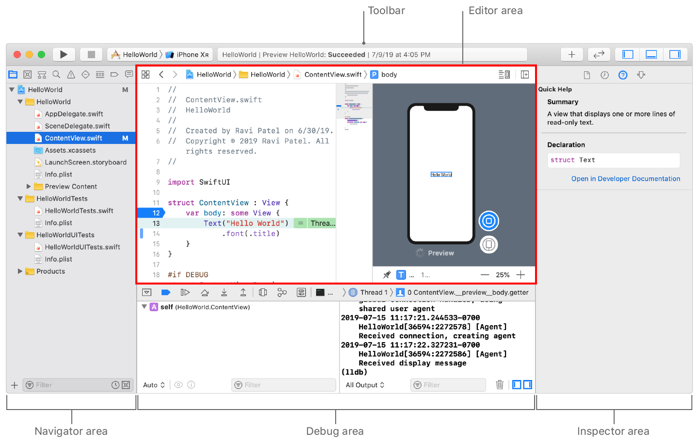

## Xcode

⌘ - Command， ⇧ - Shift， ⌃ - Control，⌥ - Option（Alt）

| Classification  | Shortcuts     | Description                    |
| --------------- | ------------- | ------------------------------ |
| **Edition**     | Tab           | Code completion                |
|                 | Esc           | Code hint                      |
|                 | ⌘ /           | Comment / Uncomment            |
|                 | ⌘  [          | Move code block left           |
|                 | ⌘  ]          | Move code block right          |
|                 | ⌘ ⌥   [       | Move Line Up                   |
|                 | ⌘  ⌥  ]       | Move Line Down                 |
|                 | ⇧ ⌘  O        | Open Quickly                   |
|                 | ⌘  J          | Move Focus to Editor           |
|                 | ⇧ ⌃ ⌘ M       | Turn on / off the Minimap      |
|                 | ⌘ + A，⌃ + I  | automatically aligns all codes |
| **Build & Run** | ⌘ + B / R / U | Compile / Run / Test           |
|                 | ⌘ `.`         | Stop                           |
|                 | ⌘ ⇧ B         | Analyze                        |
|                 | ⌘ ⇧ K         | Clean                          |
|                 | ⌥ ⌘ P         | update previews                |
|                 | ⌘ ⇧ k         | Connect Hardware Keyboard      |
| **Navigator**   | ⌘  0          | Show / Hide Navigator          |
|                 | ⌘ +  1 – 8    | Switch Tabs                    |
|                 | ⌘  T          | New Tab                        |
| **Debugging**   | ⇧ ⌘ Y         | turn on/off the debug area     |
|                 | ⌥ ⌘  1        | turn on the property observer  |
|                 | ⇧  ⌘  L       | turn on/off the Library        |

